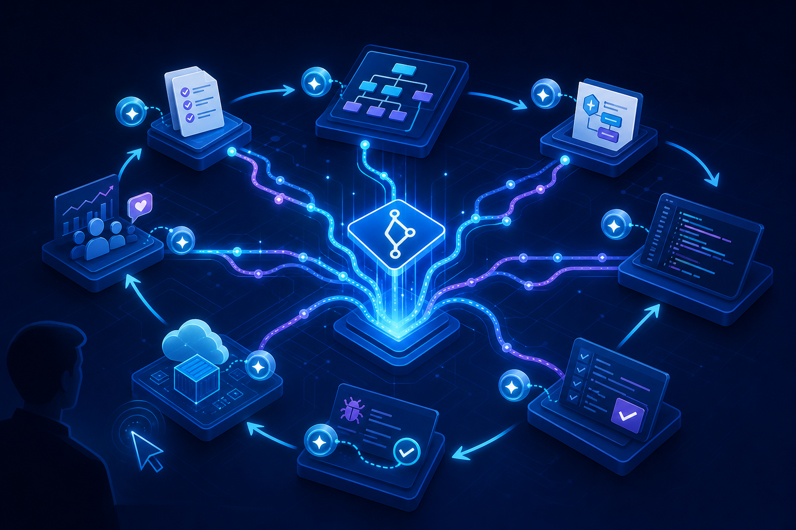

传统研发流程里，人经常充当“信息搬运者”：产品在原型工具里写需求，架构师在文档平台上补设计，后端在 Git 里写代码，接口定义散落在 Swagger，测试用例和缺陷又进入另外的平台。每次交接都要重新解释背景，信息在复制、转述和等待中不断丢失。

AI Native 研发要解决的并不只是“让 AI 多写一些代码”，而是重新组织整个研发上下文：让 Git 仓库成为协作中心，让需求、架构、接口契约、代码、测试结果和缺陷记录可以被人和 AI 同时读取，并通过版本管理形成一条可追溯的交付链路。



本文结合海外 TMS 项目 `tms-overseas` 的实际结构，介绍这套流程如何从概念落到目录、分支、提交和日常命令中。

## AI Native 不是更快地写代码

如果只是把一句需求丢给大模型，然后复制一段代码回项目，这仍然是传统流程，只是多了一个代码生成工具。真正的 AI Native 研发有三个变化。

第一，代码不再是唯一核心资产。需求、验收标准、架构决策、API 契约、测试证据、缺陷根因和变更记录，都是生产线的一部分，也都应该进入版本管理。

第二，AI 不只出现在编码环节。需求 Agent 可以把原型结构化，架构 Agent 可以形成技术约束，Coding Agent 负责实现，Test Agent 生成和执行测试，Bug Agent 根据失败证据定位原因，Review Agent 再检查代码与契约是否一致。

第三，人的工作重心从重复生产转向关键决策。人负责确认业务目标、边界、风险和最终结果；AI 在明确上下文和验收标准的约束下完成理解、生成、验证和修复。

可以把这种变化概括为：

> Git 不只是代码仓库，而是项目的 AI Context Source；开发流程不只是任务流转，而是上下文持续积累的反馈闭环。

## 代码仓库与文档仓库为什么要分开

海外 TMS 最初的设计就是建立两个 Git 仓库：一个承载可执行代码，一个承载全体角色共享的项目上下文。实际落地时，主仓库为 `tms-overseas`，文档仓库 `tms-overseas-docs` 通过 Git submodule 挂载在主仓库中。

主仓库的核心结构如下：

```text
tms-overseas/
├── tms-overseas-api/       # Feign 接口、DTO、常量等对外契约
├── tms-overseas-svc/       # Spring Boot 服务与业务实现
├── tms-overseas-docs/      # 文档子仓库（Git submodule）
├── .superpowers/sdd/       # SDD 任务拆分、执行报告与评审证据
├── devops/                 # 镜像构建与部署脚本
├── kustomize/              # Kubernetes 环境配置
├── CLAUDE.md               # AI 开发约束与项目记忆
├── .gitmodules             # 子仓库地址与路径
└── pom.xml                 # Maven 多模块入口
```

这种拆分不是为了把文档移到另一个地方，而是为了建立清晰的资产边界：

- 主仓库负责“系统如何运行”，保存源代码、测试、数据库迁移和部署配置。
- 文档仓库负责“为什么这样做、应该做成什么样、如何证明已经完成”。
- 主仓库通过 submodule 锁定一个明确的文档版本，使某次代码提交可以对应到当时真实有效的需求、接口和测试上下文。

文档仓库不是项目结束后补写的归档，而是 AI Agent 的共享上下文仓库。产品、架构、前端、后端、测试、评审和运维都从这里读取输入，并把新的结构化结果写回来。

## `tms-overseas-docs` 的实际目录设计

参考最初的 `prototype、api-docs、api-test、user-acceptance-test` 设计，项目最终扩展出了从背景到变更记录的完整目录：

```text
tms-overseas-docs/
├── 00-project-context/          # 项目背景、术语、领域模型、项目规则
├── 01-prototype/                # 产品原型与交互页面
├── 02-requirements/             # 用户故事、验收标准、功能规格
├── 03-architecture/             # 系统、模块、数据库与技术决策
├── 04-api-docs/                 # API 契约、字段、示例与错误码
├── 05-api-test/                 # 接口用例、执行结果与覆盖信息
├── 06-frontend/                 # 页面、组件与对接说明
├── 07-user-acceptance-test/     # UAT 场景、步骤与结果
├── 08-bugs/                     # 缺陷、根因、修复与回归记录
└── 09-changelog/                # 版本变更与升级说明
```

编号本身也在表达依赖顺序：后面的产物应尽量引用前面的事实，而不是重新发明一套描述。例如 API 文档必须能追溯到需求和架构，接口测试必须基于 API 契约，UAT 必须基于原型与验收标准，缺陷修复则需要关联失败用例和实际代码提交。

除原型、截图等视觉资产外，适合 AI 消费的内容优先使用 Markdown。Markdown 容易搜索、比较和引用，Git diff 也能清楚展示具体改了哪一条规则、哪个字段和哪段示例。

## 从产品构想到交付的闭环

在这套流程里，一项功能不再只是“开发完成”，而是依次经过七个阶段。

| 阶段 | 主要输入 | 人与 AI 的产出 |
|---|---|---|
| 产品构想 | 业务目标、流程、原型 | 产品原型与范围确认 |
| 需求与设计 | 原型、业务规则 | 用户故事、验收标准、架构与数据设计 |
| 开发实现 | 需求、架构、API 契约 | 后端代码、前端代码、单元测试 |
| 测试验证 | API 文档、验收标准 | 接口用例、自动化结果、UAT 结果 |
| 缺陷修复 | 失败用例、日志、截图 | 根因分析、修复代码、补充测试 |
| 发布交付 | 已通过的代码与证据 | 构建、扫描、部署、发布验证 |
| 运营反馈 | 监控、业务数据、用户反馈 | 新需求、问题趋势与优化建议 |

这条链路的关键不在于每个环节都“用了 AI”，而在于产物能够被下一个环节直接消费。需求写得足够结构化，架构 Agent 才能设计；API 契约足够完整，前端和测试 Agent 才能并行；测试失败能保存请求、响应、截图和 Trace，Bug Agent 才能复现和修复。

## SDD：先固定边界，再让 AI 实现

AI 编程最常见的问题不是不会写代码，而是在需求不完整时过早开始实现。项目因此把新增功能约束为 SDD 工作流：先形成 spec 和 plan，再拆成可以独立验证的任务。

以一个后端功能为例，AI 在开始编码前需要确认：

- 用户故事和验收标准是什么；
- 接口路径、请求字段、返回字段和错误码是什么；
- 表结构、状态流转、事务边界和跨域依赖是什么；
- 需要哪些单元测试、接口测试和回归场景；
- 哪些决策必须由人确认，哪些实现细节可以由 AI 自主完成。

实际任务还会进一步拆成 brief、实现提交、测试证据、review diff 和最终修复报告。这样做的价值不是增加文档数量，而是把一次长对话变成一组可以检查、重试和追溯的小契约。

## 后端开发：让项目规则成为可执行上下文

`tms-overseas` 是 Java 8 与 Spring Boot 2.2.7 的 Maven 多模块项目。`tms-overseas-api` 承载对外契约，`tms-overseas-svc` 承载 Controller、Facade、Service、Mapper、Entity、DTO、Convert、校验和错误码等实现。

项目把这些约束集中写入 `CLAUDE.md`：分层职责、命名规则、数据访问方式、参数校验、错误码格式、数据库迁移命名、测试命令和 Git 提交格式都成为 AI 每次开发前可以读取的项目记忆。

因此，后端 AI 开发不再是“参考附近代码猜一个实现”，而是按固定顺序落地实体、DTO、转换器、Mapper、Service、Facade、Controller、错误码和测试。生成完成后必须编译和执行相关测试，再根据真实失败修复，而不是以“代码看起来合理”作为结束条件。

## API 文档把后端、前端和测试连接起来

接口是跨角色协作最容易丢失上下文的地方。后端完成接口后，AI 根据 Controller、DTO、校验注解和实际行为增量更新 `04-api-docs/`，每个 Controller 对应一篇 Markdown 文档，包含地址、入参、返回、示例和错误码。

前端不需要等待口头说明，可以根据原型和 API 契约先完成页面，再把 Mock 请求替换为真实接口。测试也不需要重新猜测字段含义，而是从同一份契约生成正常、边界、异常和安全用例。

需要特别强调的是，文档不能只根据注解生成。真实项目里，统一异常处理器、序列化配置、字典转换和框架封装都可能改变最终响应。AI 应该同时检查代码和运行结果，发现契约与行为不一致时，修复其中一方并记录原因。

## 从接口测试到 UAT

接口测试关注的是契约和业务规则，例如必填字段、边界值、重复数据、状态流转、导入空文件和错误码。执行结果应写回 `05-api-test/`，失败场景进入 `08-bugs/`，并保留可复现的请求、响应和期望值。

UAT 关注用户是否能完成业务目标。测试 Agent 从原型和验收标准生成正常流程、异常流程、边界操作和权限场景，再通过浏览器 Agent 执行。

使用 Playwright MCP 一类能力时，AI 可以读取页面的结构化可访问性快照，通过按钮、输入框和语义角色操作页面，而不是只依赖脆弱的 CSS 坐标。页面 DOM 小幅调整后，只要业务语义没有变化，用例仍更容易找到“新增”“提交”或具体业务字段。执行过程中的截图、控制台信息和网络请求也可以作为缺陷证据回写仓库。

## 失败不是终点，而是下一轮上下文

自动化测试通过，功能才能进入交付；测试失败，则自动形成下一轮输入：

```text
失败用例
  → 请求、响应、日志、截图与 Trace
  → Bug Agent 根因分析
  → 修复建议与代码修改
  → 补充回归测试
  → 重新执行
  → 通过后更新 API 文档与 changelog
```

这样，缺陷不再只是一张写着“功能不对”的工单，而是一组机器可读取、能够复现的证据。随着问题和解决方案持续沉淀，后续 Agent 面对相似问题时拥有的上下文会越来越完整。

## 用 Git 提交区分人和 AI 的贡献

项目在 Git 提交标题中增加 `[human]` 或 `[ai]`，并继续遵循 Conventional Commits：

```text
[ai] feat(exception): add exception feedback service
[ai] docs(api): add exception feedback api doc
[human] feat(setting): restore container type options service method
```

一个完整提交还应说明具体修改，并在需要时记录共同作者：

```text
[ai] test(exception): add exception feedback regression tests

- tms-overseas-svc: cover audit status and validation failures
- tms-overseas-docs: record the verified error response

Co-authored-by: Claude <noreply@example.com>
```

这类标识适合做过程审计和趋势统计，但不应把它简单等同于精确的“AI 代码率”。一条提交可能同时包含人的设计和 AI 的实现，也可能经过人工大幅修改。真正值得关注的指标仍然是交付周期、缺陷率、测试覆盖、返工次数和需求到代码的可追溯性。

## 先理解 Git Submodule：主仓库保存的是版本指针

`tms-overseas-docs` 在文件系统里看起来是主仓库的一个普通目录，但它本身拥有独立的 Git 历史、分支和远程地址。主仓库并不会把子仓库的所有文件再次提交一遍，而是保存一个 gitlink，指向子仓库的某个 commit。

可以在主仓库根目录查看这个指针：

```bash
git ls-files --stage tms-overseas-docs
```

输出中会出现类似内容：

```text
160000 72fb9a2dca09b94334710ebbee6d9bbea3baf80b 0 tms-overseas-docs
```

`160000` 表示这是一个 gitlink，后面的 commit ID 就是主仓库当前记录的文档版本。也就是说，主仓库表达的不是“永远使用文档仓库最新代码”，而是“这个版本的主仓库应配合这个确定版本的文档仓库”。

因此，子仓库更新以后，回到主仓库执行 `git status`，会看到 `tms-overseas-docs` 发生变化。这里变化的不是某个 Markdown 文件，而是主仓库准备记录的子仓库 commit 指针。

## 初始化与复现主仓库锁定的版本

第一次克隆时，可以同时拉取子仓库：

```bash
git clone --recurse-submodules <tms-overseas-url>
```

如果主仓库已经克隆完成，再初始化即可：

```bash
git submodule update --init --recursive
```

日常拉取主仓库后，如果目标是完整复现主仓库记录的版本，可以执行：

```bash
git pull --ff-only
git submodule sync --recursive
git submodule update --init --recursive
```

默认的 `update` 会让子仓库 checkout 到主仓库记录的 commit，子仓库此时可能处于 detached HEAD，也就是“游离 HEAD”。如果只是构建、阅读或验证这个确定版本，这是 Git submodule 的正常行为，不需要强行修复。

但如果接下来要修改并提交 `tms-overseas-docs`，就不能一直停留在游离 HEAD 上。

## 修改子仓库前先 checkout 分支

准备编辑文档时，先进入子仓库，切换到实际协作分支并拉取最新提交：

```bash
cd tms-overseas-docs
git switch master
git pull --ff-only origin master
git status -sb
```

较旧版本的 Git 也可以使用：

```bash
git checkout master
```

切回分支的目的，是让新提交拥有明确的分支归属。否则在 detached HEAD 上创建的提交虽然不会立即消失，但后续切换分支后很难发现，容易形成“提交存在、分支却没有指向它”的悬空状态。

如果已经误在 detached HEAD 上提交，可以先创建分支保住它：

```bash
git switch -c rescue/docs-update
```

然后再通过 merge、rebase 或 cherry-pick 把提交带回目标分支。

## `--remote` 与 `--remote --merge` 的区别

下面两个命令看起来相近，但对工作区的影响不同。

```bash
git submodule update --remote
```

`--remote` 不再以主仓库记录的 gitlink 为更新目标，而是获取子仓库远程跟踪分支的最新 commit。若没有另外指定更新策略，默认仍是 checkout，因此很可能把子仓库放到新的 detached HEAD 上。

```bash
git submodule update --remote --merge
```

加上 `--merge` 后，Git 会把远程跟踪分支的目标 commit 合并到子仓库当前分支，子仓库的 HEAD 不会被分离。它更适合“我已经在子仓库协作分支上，现在要把远端最新变化合进来”的场景。

执行前仍应确认当前分支和工作区：

```bash
git -C tms-overseas-docs status -sb
git submodule update --remote --merge
```

如果当前存在未提交修改或双方历史发生分叉，merge 仍可能产生冲突，需要在子仓库内部按普通 Git 冲突流程处理。

当前项目的 `.gitmodules` 只配置了 `path` 和 `url`，没有显式配置 `branch`。这种情况下，`update --remote` 默认跟随子仓库远程仓库的 HEAD。为了让团队行为更明确，可以在 `.gitmodules` 中固定：

```ini
[submodule "tms-overseas-docs"]
    path = tms-overseas-docs
    url = <tms-overseas-docs-url>
    branch = master
```

修改 `.gitmodules` 后，也要把它作为主仓库变更提交。无论是否固定 branch，主仓库最终仍然只记录某个确定的子仓库 commit，不会在 checkout 时自动“漂移”到最新版本。

## 为什么必须先推子仓库，再推主仓库

提交两个仓库时，顺序必须是：先推子仓库，再更新并推主仓库的指针。

先在子仓库中完成提交和推送：

```bash
cd tms-overseas-docs
git switch master
git pull --ff-only origin master

git add 04-api-docs 05-api-test 08-bugs
git commit -m "[ai] docs(api): update overseas API verification evidence"
git push origin master
```

确认远端已经拥有这个 commit 后，回到主仓库提交 gitlink：

```bash
cd ..
git status
git diff --submodule=log

git add tms-overseas-docs
git commit -m "[ai] chore(submodule): track latest API documentation"
git push origin test
```

如果反过来先推主仓库，其他人拉到主仓库后会拿到一个指向“远端子仓库中尚不存在的 commit”的指针，`git submodule update` 就可能失败。主仓库记录版本号的前提，是该版本已经能够从子仓库远端获取。

可以把正确顺序记成：

```text
子仓库修改
  → 子仓库 commit
  → 子仓库 push
  → 主仓库记录新的 gitlink
  → 主仓库 commit
  → 主仓库 push
```

## 一套更稳妥的日常检查清单

开始工作前：

```bash
git status -sb
git submodule status
git -C tms-overseas-docs status -sb
```

只想复现主仓库锁定版本：

```bash
git submodule update --init --recursive
```

准备继续维护文档：

```bash
git -C tms-overseas-docs switch master
git -C tms-overseas-docs pull --ff-only origin master
```

需要把子仓库远端最新版本合入当前分支：

```bash
git submodule update --remote --merge
```

提交主仓库前：

```bash
git diff --submodule=log
git submodule status
```

这几步可以及时发现四类常见问题：子仓库仍在 detached HEAD、子仓库修改尚未提交、子仓库 commit 尚未推送、主仓库 gitlink 尚未更新。

## AI Native 流程真正需要治理什么

AI Native 并不意味着取消评审，也不意味着所有环节都自动化。它反而要求团队更重视上下文质量。

- 需求必须有边界和可验证的验收标准，不能只有一句模糊目标。
- API 文档必须跟真实代码和运行行为一致，不能成为过期副本。
- AI 生成的测试必须能够失败，并能证明失败原因，而不是只追求绿色数量。
- 缺陷修复必须补充回归用例，避免同类问题重复出现。
- 代码与文档版本必须建立明确关系，不能默认“最新就是正确”。
- 人仍然负责业务判断、架构取舍、风险审批和最终验收。

当这些约束通过目录、Markdown、测试、提交记录和 submodule 指针固化以后，AI 才能从一次性的聊天助手变成研发流程中的长期协作者。

## 总结

海外 TMS 的实践说明，AI Native 研发的核心不是某个模型或 IDE，而是一套围绕上下文设计的工程系统：

- 用 Git 管理代码、需求、架构、接口、测试和缺陷证据；
- 用独立文档仓库为所有角色和 Agent 提供共享上下文；
- 用 SDD 在编码前固定边界，并把工作拆成可验证任务；
- 用 API 测试、UAT 和缺陷回归形成持续反馈；
- 用 `[human]`、`[ai]` 和结构化提交保留协作痕迹；
- 用 Git submodule 把主仓库版本与确定的文档版本绑定起来。

最终，研发过程不再依赖某个人记得全部背景。上下文被写入仓库，决策可以追溯，失败可以复现，AI 可以在同一套事实基础上继续工作。这才是 AI Native 软件研发真正具有复利效应的地方。
