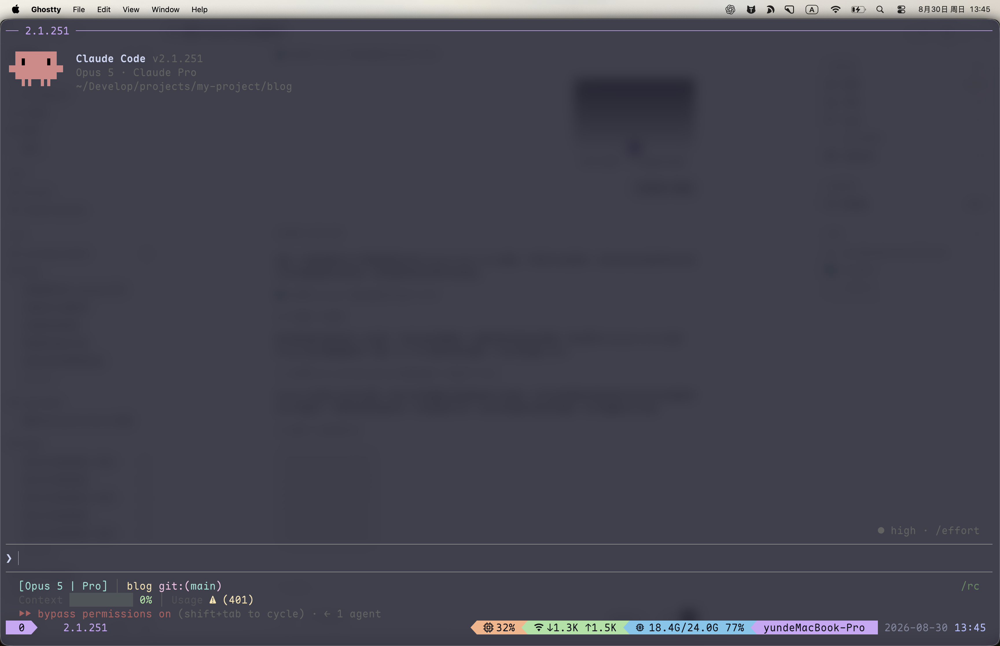

Claude Code 真正好用的地方，不只是让它“帮我写代码”，而是把会话、权限、项目记忆和不同模型组织成一套稳定的开发流程。本文记录我日常使用 Claude Code 时最常用的几个技巧。



> 本文基于 Claude Code 2.1.251 整理。CLI 和模型配置更新较快，如果命令行为与本文不同，可以先运行 `claude --help` 和 `claude --version` 确认当前版本。

## 跳过权限确认

启动 Claude Code 时可以加上：

```bash
claude --dangerously-skip-permissions
```

它等价于：

```bash
claude --permission-mode bypassPermissions
```

开启后，Claude Code 执行命令、修改文件时不会逐次询问权限，适合在隔离的容器、临时项目或已经做好版本控制保护的目录中运行。进入该模式后，终端底部会显示 `bypass permissions on`，上面的截图就是这种状态。

这个参数的名字里带有 `dangerously` 不是为了吓人：它确实会移除大部分操作保护。不要在包含生产凭据、重要文件或不可信代码的目录中直接使用，也不要用 `sudo` 启动。至少先确认当前目录正确、敏感文件没有暴露，并保证代码已经提交或可以通过 Git 恢复。

如果只是希望少确认几次，可以先使用 `acceptEdits`、`auto` 等权限模式，而不是直接跳过全部权限检查。

## 恢复之前的对话

Claude Code 提供两组启动参数恢复历史会话。

### 继续最近的会话

```bash
claude --continue
claude -c
```

`--continue` 和 `-c` 会恢复当前目录最近的一次会话，不显示选择器。它适合刚退出 Claude Code，又想马上继续刚才工作的场景。

### 从历史会话中选择

```bash
claude --resume
claude -r
```

`--resume` 和 `-r` 会打开历史会话选择器。知道会话名称或 ID 时，也可以直接指定：

```bash
claude --resume "auth-refactor"
claude -r "auth-refactor"
```

这些参数需要在尚未进入 Claude Code 时，从 shell 中执行。它们不是只能用于“非交互查询”：默认仍然会恢复并进入交互会话；只有配合 `-p` 时，才是执行一次查询后退出的非交互用法。

如果已经进入 Claude Code，想切换到另一个历史会话，直接输入：

```text
/resume
```

它会在当前界面中打开会话选择器。可以把几种方式简单记成：

| 场景 | 命令 |
|---|---|
| 在 shell 中继续当前目录最近的会话 | `claude -c` |
| 在 shell 中选择历史会话 | `claude -r` |
| 在 Claude Code 内切换历史会话 | `/resume` |

不同项目可能存在名称相近的会话。恢复以后，先让 Claude 总结当前目标、已完成内容和未提交改动，再继续执行，可以避免接错上下文。

## 用 `/memory` 管理长期记忆

在会话期间输入：

```text
/memory
```

Claude Code 会列出当前加载的 `CLAUDE.md`、`CLAUDE.local.md`、规则文件和自动记忆，并允许在系统编辑器中打开对应文件。这里适合检查“Claude 到底读到了哪些项目约定”，也可以开启或关闭自动记忆。

常见的记忆可以分成两类：

- `CLAUDE.md`：由开发者维护，适合保存项目结构、构建命令、编码规范和必须遵守的工作流。
- Auto memory：由 Claude 自动记录，适合保存排错经验、项目习惯和你反复纠正过的偏好。

例如，一个简洁的项目级 `CLAUDE.md` 可以这样写：

```markdown
# 项目约定

- 使用 pnpm，不要使用 npm 或 yarn。
- 修改 TypeScript 后运行 pnpm typecheck。
- 优先运行受影响的单元测试，不要默认执行全部测试。
- 提交前检查 git diff，不要修改无关文件。
```

记忆文件不是越长越好。只保留每次会话都值得加载的高频规则；很长的操作步骤更适合拆成 Skill 或 `.claude/rules/` 中的按路径规则。发现 Claude 没有遵循某条约定时，可以先运行 `/memory` 检查文件是否加载，再用 `/context` 查看上下文占用情况。

## 配置 DeepSeek

DeepSeek 提供了 Anthropic 兼容接口，可以通过环境变量让 Claude Code 使用 DeepSeek 模型。下面给 `zsh` 定义一个单独的 `claude-ds` 函数，不会影响平时使用 Claude 原生模型的 `claude` 命令：

```bash
# Claude Code + DeepSeek
claude-ds() {
  env \
    ANTHROPIC_BASE_URL="https://api.deepseek.com/anthropic" \
    ANTHROPIC_AUTH_TOKEN="sk-xx" \
    ANTHROPIC_MODEL="deepseek-v4-pro[1m]" \
    ANTHROPIC_DEFAULT_OPUS_MODEL="deepseek-v4-pro[1m]" \
    ANTHROPIC_DEFAULT_SONNET_MODEL="deepseek-v4-pro[1m]" \
    ANTHROPIC_DEFAULT_HAIKU_MODEL="deepseek-v4-flash" \
    CLAUDE_CODE_SUBAGENT_MODEL="deepseek-v4-flash" \
    CLAUDE_CODE_EFFORT_LEVEL="max" \
    CLAUDE_CODE_AUTO_COMPACT_WINDOW="786432" \
    claude "$@"
}
```

把它加入 `~/.zshrc`，将 `sk-xx` 替换为自己的 DeepSeek API Key，然后重新加载配置：

```bash
source ~/.zshrc
claude-ds
```

函数末尾的 `"$@"` 会把额外参数原样传给 Claude Code，所以前面的会话恢复和权限参数都可以继续使用：

```bash
claude-ds -c
claude-ds -r
claude-ds --dangerously-skip-permissions
```

这段配置中，主任务、Opus 和 Sonnet 别名映射到 `deepseek-v4-pro[1m]`，Haiku 与子代理映射到速度更快的 `deepseek-v4-flash`，推理强度设为 `max`，自动压缩窗口设为 `786432`。这些值来自 DeepSeek 当前的 Claude Code 接入文档，后续模型名称或推荐值变化时，应以官方文档为准。

不要把真实 API Key 写进项目文件或提交到 Git。更稳妥的做法是把密钥放进私有的 shell 配置、密码管理器或专用的环境变量文件，并限制文件权限。

## 用 Claude 和 DeepSeek 做 SDD 开发

我的 SDD（Spec-Driven Development，规格驱动开发）流程会把“想清楚”和“批量实现”分开：Spec 与 Plan 使用 Claude 原生模型，具体实现使用 Claude Code 接入 DeepSeek，最后再切回 Claude 原生模型审核。

### 1. Spec：先把需求写清楚

使用 Claude 原生模型分析需求，不急着改代码。让它把目标、非目标、验收条件、边界情况和未知项写进仓库中的规格文件，例如：

```text
先不要修改代码。阅读相关实现，把需求整理为 docs/specs/user-search.md。
规格必须包含：背景、目标、非目标、用户流程、接口变化、边界情况和可验证的验收条件。
遇到无法从代码确认的信息，列为待确认项，不要自行假设。
```

### 2. Plan：把规格拆成可执行计划

规格确认以后，继续使用 Claude 原生模型制定 Plan：

```text
基于 docs/specs/user-search.md 制定实现计划，写入 docs/plans/user-search.md。
列出需要修改的文件、每一步的验证方式、可能的迁移和回滚方案。
先完成计划，不要开始实现。
```

Spec 和 Plan 最好落成文件，而不是只留在会话历史里。这样切换模型、压缩上下文或换一台机器时，实施依据仍然清楚。

### 3. Implement：用 Claude Code + DeepSeek 执行

打开新的终端，在同一项目目录运行：

```bash
claude-ds
```

然后让 DeepSeek 严格按照已经确认的规格和计划实现：

```text
阅读 docs/specs/user-search.md 和 docs/plans/user-search.md，按计划逐步实现。
每完成一步就运行对应验证；不要扩展规格范围，不要修改无关文件。
完成后总结实际改动、测试结果和仍存在的风险。
```

DeepSeek 负责大量代码阅读、编辑和测试，能降低实现阶段的模型成本。遇到架构冲突或规格缺口时，让它暂停并记录问题，再回到 Claude 原生模型更新 Spec 或 Plan，不要让实现模型临时改变目标。

### 4. Review：切回 Claude 原生模型审核

实现结束后，重新使用 Claude 原生模型，让它基于规格审查实际 diff：

```text
根据 docs/specs/user-search.md 审核当前 git diff。
重点检查：验收条件是否全部满足、是否存在回归或安全问题、测试是否覆盖边界情况、实现是否超出范围。
先给出按严重程度排序的问题，不要直接修改代码。
```

确认审核意见后，再让 Claude 修复高优先级问题并执行最终验证。整个流程可以概括为：

```text
Claude 原生模型：Spec → Plan
DeepSeek：Implement → Test
Claude 原生模型：Review → Final verification
```

这种分工的价值不只是节省成本。Claude 原生模型负责需求理解、架构判断和最终质量门禁，DeepSeek 负责按照明确计划完成大规模执行；而 Spec、Plan 和 Git diff 则成为不同模型之间可检查、可追踪的交接物。

## 我最常用的一组命令

```text
claude -c                              继续当前目录最近的会话
claude -r                              选择一个历史会话
/resume                                在当前会话中切换历史会话
/memory                                查看和编辑项目记忆
/context                               查看当前上下文占用
claude --dangerously-skip-permissions  跳过权限确认，高风险
claude-ds                              使用 DeepSeek 启动 Claude Code
```

最后一个实用习惯：不管使用哪个模型，都先让它读清楚目标和现有改动，再授权执行。一个短而明确的 Spec，加上一份可以逐项验证的 Plan，通常比反复补充零散提示更可靠。

参考：[Claude Code CLI reference](https://code.claude.com/docs/en/cli-reference)、[Claude Code sessions](https://code.claude.com/docs/en/sessions)、[Claude Code memory](https://code.claude.com/docs/en/memory)、[Claude Code permission modes](https://code.claude.com/docs/en/permission-modes)、[DeepSeek 接入 Claude Code](https://api-docs.deepseek.com/zh-cn/quick_start/agent_integrations/claude_code/)。
