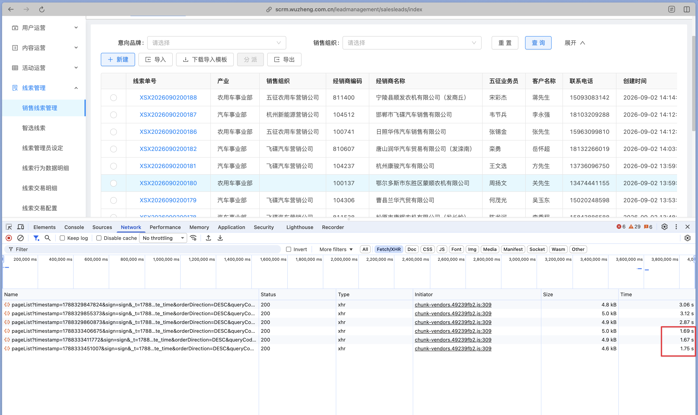
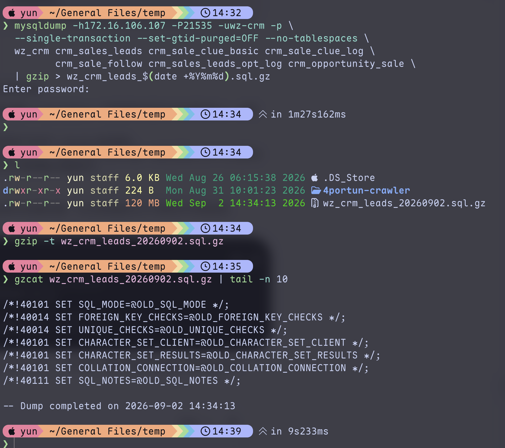
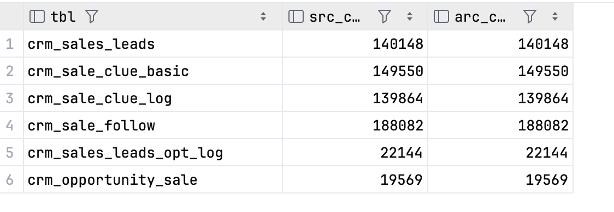
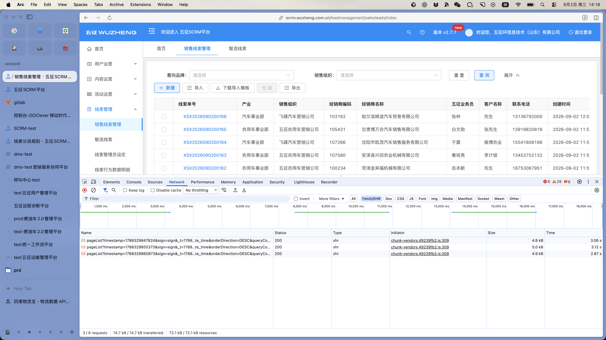

CRM 的销售线索列表打开一次要 3 秒。翻页、筛选、导出全都卡在同一个接口上，`pageList`。

表里躺着 27 万条线索，其中一半以上是 2024 年及以前的。这些老线索业务上早就不看了，但每一次查询都要把它们扫一遍。于是有了这次归档：把 2024-12-31 之前的线索连同它的跟进记录、来源明细、操作日志一起搬到归档表，再从业务库物理删除。

结果是接口从 3.0 秒降到 1.7 秒。



上面三条是归档前（3.06s / 3.12s / 2.87s），下面三条是归档后（1.69s / 1.67s / 1.75s）。

这篇记录整个过程：怎么确定范围、怎么保证一行都不丢、怎么删才不会把库拖垮，以及为什么删数据能让 SQL 快一倍。

## 先搞清楚要动哪些表

线索不是一张表能装下的。真正要处理的是一组按 `clue_number`（线索单号）串起来的表：

| 表 | 说明 | 关系 |
|---|---|---|
| `crm_sales_leads` | 线索基本信息，含意向品牌 / 车系 / 车型 | 主表，`clue_number` 唯一 |
| `crm_sale_clue_basic` | 线索前置表，一次推荐落一行 | 一对多，**行数即"来源热度"** |
| `crm_sale_clue_log` | 线索日志，含 `recommend_times`、首次跟进时间、战败关联 | 一对一 |
| `crm_sale_follow` | 跟进记录 | 一对多 |
| `crm_sales_leads_opt_log` | 线索操作日志 | 一对多 |
| `crm_opportunity_sale` | 实销登记 | 一对多，**只归档不删** |

这里有两个容易踩空的点。

**第一，"意向车型"不是一张表。** 它是 `crm_sales_leads` 上的三个字段：`intention`（品牌）、`intende_series`（车系）、`intende_sub_series`（车型）。归档主表就等于归档了它。

**第二，"来源热度"也不是一个字段那么简单。** 页面上的来源热度取自 `crm_sale_clue_log.recommend_times`，但它的原始明细在 `crm_sale_clue_basic` —— 同一个客户被推荐几次就有几行。两张表都得归档，否则档案是残的。

确认关系时先查了一遍库里有没有外键：

```sql
SELECT COUNT(*) FROM information_schema.key_column_usage
 WHERE table_schema = 'wz_crm' AND referenced_table_name IS NOT NULL;
-- 0
```

一个外键都没有。这是好消息也是坏消息：删除时不用管约束顺序，但也没有任何东西拦着你把子表删成孤儿。一致性只能靠自己保证。

顺带确认主表的 `clue_number` 确实唯一：

```sql
SELECT COUNT(DISTINCT clue_number), COUNT(*) FROM crm_sales_leads;
-- 274837  274837
```

相等。`clue_number` 可以放心当归档主键用。

## 为什么删数据能让接口快一倍

在动手前，值得先弄明白提速从哪来。看 `pageList` 的核心 SQL：

```sql
SELECT ...
FROM crm_sales_leads c
LEFT JOIN crm_sale_clue_log sclog ON c.clue_number = sclog.clue_number
LEFT JOIN (
    SELECT clue_number, COUNT(*) AS flowCount
    FROM crm_sale_follow
    GROUP BY clue_number
) csf ON csf.clue_number = c.clue_number
LEFT JOIN crm_failure_info cfi ON cfi.id = sclog.fail_id
LEFT JOIN crm_source_categorie csccn ON csccn.id = c.source_categories
-- ... 还有 5 个 LEFT JOIN
WHERE <动态条件>
ORDER BY c.create_time DESC
```

问题出在那个派生表（derived table）上：

```sql
LEFT JOIN (SELECT clue_number, COUNT(*) FROM crm_sale_follow GROUP BY clue_number) csf
```

MySQL 5.7 对**带 `GROUP BY` 的派生表不做 derived merge**（合并进外层查询），只能走物化（materialization）：把子查询完整跑一遍、结果写进内部临时表、再和外层 JOIN。也就是说——**每一次翻页，都要把整张 `crm_sale_follow` 表扫一遍并分组**。归档前这张表 39 万行。

第二个成本是排序。`crm_sales_leads` 上的索引只有 `province`、`city`、`district`、`phone`，`create_time` 上没有索引：

```sql
SHOW CREATE TABLE crm_sales_leads;
-- PRIMARY KEY (`id`) USING BTREE,
-- KEY `province` (`province`), KEY `city` (`city`),
-- KEY `district` (`district`), KEY `phone` (`phone`)
```

所以 `ORDER BY c.create_time DESC` 必然是 filesort，排序集合就是过滤后的整个结果集。

两个成本都**只跟行数线性相关**。所以结论很朴素：这次提速不是"优化了 SQL"，而是把这条 SQL 每次必须扫的数据量砍掉了一半。`crm_sale_follow` 从 39 万降到 20 万，`crm_sales_leads` 从 27 万降到 13 万，耗时就从 3 秒降到 1.7 秒——几乎是线性的。

这也意味着归档只是把问题推后了。真正的治本手段是给 `create_time` 加索引、把派生表改成维护一个跟进次数计数列。但那要改代码、要回归测试，而归档是纯数据操作，当天就能见效。**先止血，再治本。**

## 定口径：删多少

清单只有一个条件，字面执行"2024-12-31 之前创建的线索"：

```sql
SET @cut = '2025-01-01 00:00:00';
SELECT COUNT(*) FROM crm_sales_leads WHERE create_time < @cut;
-- 140148
```

14 万条，占全表一半以上。

但删之前得知道这 14 万条里有什么。按状态分组：

```sql
SELECT status, COUNT(*) FROM crm_sales_leads
 WHERE create_time < '2025-01-01' GROUP BY status;
```

| status | 含义 | 条数 |
|---|---|---|
| 0 | 未开始 | 278 |
| 1 | 跟进中 | 10,656 |
| 2 | 成交 | 41,047 |
| 3 | 战败 | 86,378 |
| 4 | 变更 | 1,789 |

`278 + 10656 + 41047 + 86378 + 1789 = 140148`，对得上。

**这里有 10,934 条 status 是 0 或 1 的线索，也就是还没闭环、理论上还在跟进的。** 另外还有 3,743 条老线索在 2025 年被 update 过，19,645 行跟进记录是 2025 年后补录到老线索上的。

所以当时准备了两个口径：

- **口径 A**：只看 `create_time < 2025-01-01`，140,148 条
- **口径 B**：再加"已闭环（status 2/3/4）且 2025 年后无任何动作"，111,305 条

最后选了 A。代价是明确的，写在下面"业务影响"一节里。这类决定没有标准答案，但**必须在删之前把代价算清楚、写下来**，而不是删完了再发现。

## 方案的三个关键设计

### 一、清单表：先把集合冻结下来

最容易出错的做法，是每一条语句都重新写一遍 `WHERE create_time < '2025-01-01'`。

生产库是活的。归档跑了一个多小时，期间一直有新线索写入、老线索被更新。如果复制时算一次集合、删除时又算一次，两次算出来的集合就可能不一样——复制漏掉的行会被删掉，这就是永久丢数据。

所以第一步是建一张清单表，把 `clue_number` 集合**冻结**成物理行：

```sql
CREATE TABLE wz_crm.arc_clue_manifest (
  clue_number      varchar(32)  NOT NULL COMMENT '线索单号',
  lead_id          varchar(64)  DEFAULT NULL,
  lead_status      varchar(10)  DEFAULT NULL COMMENT '归档时线索状态',
  lead_create_time datetime     DEFAULT NULL,
  batch_no         varchar(32)  NOT NULL COMMENT '归档批次号',
  archived_at      datetime     NOT NULL DEFAULT CURRENT_TIMESTAMP,
  PRIMARY KEY (clue_number),
  KEY idx_batch (batch_no)
) ENGINE=InnoDB DEFAULT CHARSET=utf8mb4 COMMENT='线索归档批次清单';

INSERT INTO wz_crm.arc_clue_manifest
       (clue_number, lead_id, lead_status, lead_create_time, batch_no)
SELECT l.clue_number, l.id, l.status, l.create_time, 'ARC20241231'
  FROM wz_crm.crm_sales_leads l
 WHERE l.create_time < '2025-01-01 00:00:00';
```

之后的复制、校验、删除**全部 JOIN 这张表**，不再出现任何 `create_time` 条件。集合在这一刻定死，后面无论库里怎么变都影响不到它。

这个设计还顺手带来三个好处：可重跑（清单在，任何一步都能重来）、可回滚（清单是这批数据的目录）、可追溯（半年后想知道当时删了什么，查它就行）。

冻结效果在最终数据里能直接看出来。归档前后主表行数：

```sql
-- 归档前
SELECT COUNT(*) FROM crm_sales_leads;  -- 274855
-- 清单
SELECT COUNT(*) FROM arc_clue_manifest; -- 140148
-- 归档后
SELECT COUNT(*) FROM crm_sales_leads;  -- 134715
```

`274855 - 140148 = 134707`，实际剩下 `134715`，多出 **8 条**。这 8 条是归档期间新建的线索。它们没有出现在清单里，所以从头到尾都不在删除范围内——这正是清单表要达到的效果。如果当时用的是动态 `WHERE create_time < ...`，这 8 条虽然也不满足条件，但整个方案就失去了"删除集合可验证"这个性质。

### 二、镜像表用 `CREATE TABLE ... LIKE`

归档表结构不手写，直接从源表复制：

```sql
CREATE TABLE IF NOT EXISTS wz_crm.arc_crm_sales_leads     LIKE wz_crm.crm_sales_leads;
CREATE TABLE IF NOT EXISTS wz_crm.arc_crm_sale_clue_basic LIKE wz_crm.crm_sale_clue_basic;
-- ... 其余同理
```

`CREATE TABLE ... LIKE` 复制的是**完整的表定义**：所有列、类型、默认值、字符集、以及全部索引（主键、普通索引、唯一索引）。不复制的是：表数据、外键约束、以及 `AUTO_INCREMENT` 的当前计数值（属性保留，计数器归零）。

为什么不手写 DDL？因为归档语句是这样的：

```sql
INSERT INTO wz_crm.arc_crm_sales_leads
SELECT l.* FROM wz_crm.crm_sales_leads l
  JOIN wz_crm.arc_clue_manifest m ON m.clue_number = l.clue_number;
```

`SELECT l.*` 要求目标表的列数、列序、类型**完全对齐**源表。用 `LIKE` 建表，这个前提永远成立；手写 DDL 则一旦源表加了字段就会炸，或者更糟——列错位但类型恰好兼容，静默写错数据。

唯一手动补的是一个索引。源表 `crm_sales_leads` 上没有 `clue_number` 索引（业务查询走的是别的路径），但归档表的主要用途就是按线索单号翻档案：

```sql
ALTER TABLE wz_crm.arc_crm_sales_leads ADD KEY idx_clue_number (clue_number);
```

归档表放在同库用 `arc_` 前缀，而不是独立库。原因很实际：现有账号没有 `CREATE DATABASE` 权限。如果 DBA 愿意开，独立库 `wz_crm_archive` 更好——业务库看不到这些表，整库 dump 和 drop 都更干净。

### 三、子表按 `clue_number` 关联，不按自己的 `create_time`

这是最反直觉的一条。归档子表时，条件是"父线索在清单里"，而**不是**"这行子记录也是 2024 年的"：

```sql
INSERT INTO wz_crm.arc_crm_sale_follow
SELECT f.* FROM wz_crm.crm_sale_follow f
  JOIN wz_crm.arc_clue_manifest m ON m.clue_number = f.clue_number;
```

如果按子表自己的 `create_time` 过滤，会出现这种断档：一条 2024 年的老线索被归档删掉了，但它在 2025 年补录的那条跟进记录不满足 `create_time < 2025`，于是留在业务库里，成了一条挂在不存在线索上的孤儿记录。

数字上能直接看到差异。`crm_sale_follow` 表里：

- 按 `create_time < 2025-01-01` 过滤：168,753 行
- 按"父线索在清单里"关联：**188,082 行**

差的 19,329 行，正是 2025 年后补录到老线索上的跟进记录。加上 316 行本来就没有父线索的历史孤儿（不在清单范围内，另行处理），`168753 - 316 + 19645 = 188082`，严丝合缝。

**归档的单位是"一条线索的完整档案"，不是"一批时间落在某区间的行"。**

## 备份：没验证的备份等于没备份

归档表和业务表在同一个实例上。实例挂了，两边一起没。所以物理备份是独立于整个方案的第一道保险。

```bash
mysqldump -h172.16.106.107 -P21535 -uwz-crm -p \
  --single-transaction --set-gtid-purged=OFF --no-tablespaces \
  wz_crm crm_sales_leads crm_sale_clue_basic crm_sale_clue_log \
         crm_sale_follow crm_sales_leads_opt_log crm_opportunity_sale \
  | gzip > wz_crm_leads_$(date +%Y%m%d).sql.gz
```



1 分 27 秒，产出 120MB 的 gz 包。三个参数值得解释：

- **`--single-transaction`**：dump 开始时开一个 `REPEATABLE READ` 事务并建立一致性快照，整个导出过程读的都是同一个时间点的数据，**且不加表锁**。这是 InnoDB 在线备份的标准姿势。如果不加，mysqldump 默认会 `LOCK TABLES READ`，生产库上直接把写请求堵死。注意它只对 InnoDB 有效，MyISAM 表照样得锁。
- **`--set-gtid-purged=OFF`**：源库开了 GTID 时，mysqldump 默认会在 dump 文件头部写一句 `SET @@GLOBAL.GTID_PURGED='...'`。这句话在导入到另一个实例时会失败或污染目标库的 GTID 状态。备份是拿来恢复数据的，不是拿来做复制拓扑的，关掉它。
- **`--no-tablespaces`**：用 8.0 的 mysqldump 客户端连 5.7 服务端时，客户端会尝试导出表空间信息，而这需要 `PROCESS` 全局权限。业务账号一般没有，加上这个参数跳过。

导完立刻验两件事：

```bash
gzip -t wz_crm_leads_20260902.sql.gz          # 校验 gz 完整性，无输出即通过
gzcat wz_crm_leads_20260902.sql.gz | tail -n 10
# -- Dump completed on 2026-09-02 14:34:13
```

`gzip -t` 走一遍解压并核对 CRC，能发现截断和坏块。`tail` 看最后那行 `Dump completed` 更关键——**mysqldump 只有正常跑完才会写这一行**。如果中途连接断了、磁盘满了，前面的数据看着都在，但结尾没有这行，说明这是个残包。管道 `| gzip` 会吞掉 mysqldump 的退出码（`$?` 拿到的是 gzip 的），所以这一步不能省。

## 校验：删之前必须全等

复制完成后，逐表比对"业务库里属于清单的行数"和"归档表实际行数"：

```sql
SELECT 'crm_sales_leads' AS tbl,
       (SELECT COUNT(*) FROM wz_crm.crm_sales_leads s
          JOIN wz_crm.arc_clue_manifest m ON m.clue_number = s.clue_number) AS src_cnt,
       (SELECT COUNT(*) FROM wz_crm.arc_crm_sales_leads)                    AS arc_cnt
UNION ALL SELECT 'crm_sale_clue_basic', ... ;
```



六张表全部相等：

| 表 | 归档行数 |
|---|---|
| `crm_sales_leads` | 140,148 |
| `crm_sale_clue_basic` | 149,550 |
| `crm_sale_clue_log` | 139,864 |
| `crm_sale_follow` | 188,082 |
| `crm_sales_leads_opt_log` | 22,144 |
| `crm_opportunity_sale` | 19,569 |

合计 **659,357 行**。其中 `crm_opportunity_sale` 只归档不删，实际删除 639,788 行。

行数相等只能证明数量没丢，不能证明内容没错位。所以再比一次内容，用 `<=>`（NULL 安全等于）：

```sql
SELECT COUNT(*) AS mismatch
  FROM wz_crm.crm_sales_leads s
  JOIN wz_crm.arc_crm_sales_leads a ON a.id = s.id
 WHERE NOT (a.clue_number <=> s.clue_number)
    OR NOT (a.phone       <=> s.phone)
    OR NOT (a.status      <=> s.status)
    OR NOT (a.create_time <=> s.create_time)
    OR NOT (a.intention   <=> s.intention)
    OR NOT (a.intende_sub_series <=> s.intende_sub_series);
-- 期望 0
```

这里必须用 `<=>` 而不是 `=`。`NULL = NULL` 的结果是 `NULL` 不是 `TRUE`，用 `<>` 判不等时两个都为 NULL 的行会被静默跳过——而这些字段（比如 `intende_sub_series`）恰恰有大量 NULL。`<=>` 把 NULL 当成一个可比较的值，`NULL <=> NULL` 返回 1。外面套 `NOT (...)` 就是"两边不一致"。

## 删除：为什么要写存储过程

最直白的写法是一条 DELETE 搞定：

```sql
DELETE t FROM wz_crm.crm_sale_follow t
  JOIN wz_crm.arc_crm_sale_follow a ON a.id = t.id;
```

18 万行，几秒钟的事。但它有三个问题：

1. **大事务**。18 万行的 undo log 要一直保留到事务提交，期间这些行的旧版本无法被 purge 线程回收，undo 表空间会涨。
2. **锁范围大**。删除期间这 18 万行全部持有行锁，并发的业务写入会大量等锁甚至超时。
3. **主从延迟**。row 格式 binlog 下这是 18 万个 row event，一次性写进 binlog 再传给从库回放。六张表加起来 64 万行，从库很可能延迟到分钟级。

所以改成分批。分批的关键是**怎么翻页**。常见的错误写法是 `LIMIT offset, n`——offset 越大扫得越多，整体复杂度 O(n²)。正确做法是 keyset pagination（也叫 seek method）：记住上一批的最大主键，下一批从它之后开始。

```sql
DROP PROCEDURE IF EXISTS wz_crm.sp_purge_archived;
DELIMITER $$
CREATE PROCEDURE wz_crm.sp_purge_archived(
    IN p_src   VARCHAR(128),   -- 业务表，如 'wz_crm.crm_sale_follow'
    IN p_arc   VARCHAR(128),   -- 归档表，如 'wz_crm.arc_crm_sale_follow'
    IN p_batch INT)            -- 单批行数
BEGIN
  DECLARE v_go INT DEFAULT 1;
  SET @last = '';
  WHILE v_go = 1 DO
    -- 从归档表取下一段主键的上界
    SET @sql = CONCAT('SELECT MAX(id) INTO @hi FROM (SELECT id FROM ', p_arc,
                      ' WHERE id > @last ORDER BY id LIMIT ', p_batch, ') z');
    PREPARE st FROM @sql; EXECUTE st; DEALLOCATE PREPARE st;

    IF @hi IS NULL THEN
      SET v_go = 0;
    ELSE
      SET @sql = CONCAT('DELETE t FROM ', p_src, ' t JOIN ', p_arc, ' a ON a.id = t.id ',
                        'WHERE a.id > @last AND a.id <= @hi');
      PREPARE st FROM @sql; EXECUTE st; DEALLOCATE PREPARE st;
      SET @last = @hi;
      DO SLEEP(0.05);   -- 给主从留追赶时间
    END IF;
  END WHILE;
END$$
DELIMITER ;
```

几个设计点：

**`DELIMITER $$` 是客户端指令，不是 SQL。** 存储过程体内部有分号，如果不临时把语句结束符改掉，客户端会在第一个分号处就把语句切断。`$$` 只是个约定俗成的替代符号，用 `//` 也一样。注意某些 GUI 客户端不支持 `DELIMITER`，得用它自己的方式执行。

**用 `PREPARE`/`EXECUTE` 是因为表名不能参数化。** SQL 里占位符只能出现在值的位置，`FROM ?` 是非法的。要写一个通用于六张表的过程，只能拼字符串再动态执行。这里的表名是硬编码传入的常量，不来自外部输入，没有注入风险。

**删除条件锚定归档表，而不是清单表。** `DELETE ... JOIN arc_xxx ON a.id = t.id` 的含义是"只删除那些已经躺在归档表里的行"。这是整个方案最重要的安全性质：**没归档成功的行，物理上不可能被删到**。哪怕复制步骤漏了几行、哪怕清单和实际数据对不上，删除也只会少删，不会多删。

**主键区间而不是主键集合。** `WHERE a.id > @last AND a.id <= @hi` 让两边都能走主键索引做范围扫描，比 `id IN (...)` 一大串值高效得多。这里的 `id` 是 varchar，字符串比较同样有序，keyset 一样成立。

**`DO SLEEP(0.05)`** 每批之间歇 50 毫秒，给从库回放和 purge 线程留出窗口。单机无从库可以去掉。

**幂等。** 中途 Ctrl-C 了直接重新 `CALL` 一次即可：已删掉的行 JOIN 不上，会被跳过。

调用顺序先子表后主表：

```sql
CALL wz_crm.sp_purge_archived('wz_crm.crm_sales_leads_opt_log', 'wz_crm.arc_crm_sales_leads_opt_log', 2000);
CALL wz_crm.sp_purge_archived('wz_crm.crm_sale_follow',         'wz_crm.arc_crm_sale_follow',         2000);
CALL wz_crm.sp_purge_archived('wz_crm.crm_sale_clue_log',       'wz_crm.arc_crm_sale_clue_log',       2000);
CALL wz_crm.sp_purge_archived('wz_crm.crm_sale_clue_basic',     'wz_crm.arc_crm_sale_clue_basic',     2000);
CALL wz_crm.sp_purge_archived('wz_crm.crm_sales_leads',         'wz_crm.arc_crm_sales_leads',         2000);
```

库里没有外键，顺序不影响正确性。但万一中途失败，"子表已删、主表还在"比"主表已删、子表变孤儿"要好收拾得多。

## OPTIMIZE TABLE：删掉的空间不会自己还回来

删完 64 万行，`df` 看磁盘占用纹丝不动。这是 InnoDB 的正常行为：`DELETE` 只把行标记为删除并把页内空间挂到空闲链表上，留待后续插入复用，**不会把空间还给操作系统**，`.ibd` 文件也不会变小。表里于是留下大量空洞，页填充率下降，扫描同样多的行要读更多的页。

回收要靠 `OPTIMIZE TABLE`：

```sql
OPTIMIZE TABLE wz_crm.crm_sales_leads;
OPTIMIZE TABLE wz_crm.crm_sale_follow;
-- ...
```

执行后会看到这么一条提示：

```json
{
  "Table": "wz_crm.crm_sales_leads_opt_log",
  "Op": "optimize",
  "Msg_type": "note",
  "Msg_text": "Table does not support optimize, doing recreate + analyze instead"
}
```

这条 note 看着像警告，其实是**正常且预期**的。InnoDB 没有实现 MyISAM 那种原地整理，MySQL 在这里把 `OPTIMIZE TABLE` 映射成了 `ALTER TABLE ... FORCE` + `ANALYZE TABLE`：按主键顺序重建整张表和所有二级索引，然后重新统计索引基数。重建后页是紧凑的，空洞消失，`.ibd` 文件真正缩小。

后面紧跟的 `"Msg_type": "status", "Msg_text": "OK"` 才是执行结果。

两个注意事项：

- MySQL 5.6.17 之后这是 **online DDL**（`ALGORITHM=INPLACE`），重建期间允许并发 DML，但**开始和结束各需要一次短暂的排它元数据锁**。有长事务或长查询压着表时，这个 MDL 会排队并阻塞后续所有请求，所以还是放业务低峰做。
- 重建需要**额外的磁盘空间**，峰值大约是表的两倍。这次几张表加起来约 430MB，压力不大；上 GB 的表要先看剩余空间。

## 效果



| | 归档前 | 归档后 |
|---|---|---|
| `pageList` 耗时 | 3.06s / 3.12s / 2.87s | 1.69s / 1.67s / 1.75s |
| 平均 | 3.02s | 1.70s |
| `crm_sales_leads` | 274,855 行 | 134,715 行 |
| `crm_sale_follow` | 393,298 行 | 约 205,000 行 |

（`crm_sale_follow` 的剩余行数是 `393298 - 188082` 推算的，没有单独再 count 一次；主表两个数字都是实测。）

接口提速约 **44%**，1.8 倍。跟行数的下降幅度基本吻合，印证了前面的判断：瓶颈就是全表扫描的数据量，没有别的玄机。

## 业务影响：选口径 A 的代价

这次选了口径 A（只看创建时间），意味着 10,934 条未闭环的老线索也被删了。已知的影响有六条，删之前就写清楚了：

1. **未闭环线索消失。** 278 条未开始 + 10,656 条跟进中，经销商和销售在列表里再也看不到，无法继续跟进。看板的 `notStartCount` / `startCount` 同步减少。
2. **手机号排重失效。** 排重逻辑只在"未闭环线索"里查同产业同手机号，命中才提示"此手机号已在【经销商】处，被推荐【来源热度】，无需重复创建"。这批线索删掉后，对应手机号可以被重新录成新线索。
3. **来源热度归零。** 热度 = `crm_sale_clue_basic` 中同 `clue_number` 的行数。历史推荐行删掉后，同一客户再次推荐时热度从 1 起算，跨年的重复推荐次数看不出来了。
4. **外部系统按时间窗拉取会拉空。** 智选侧的拉取查询是 `FROM crm_sales_leads WHERE source_tag='WZZX' AND status IN ('2','3')`，按 `crm_sale_clue_log.result_time` 做时间窗过滤。凡是 `result_time` 落在 2024 及以前的窗口，删除后一律返回空。执行前跟对方确认过只轮询近期窗口。
5. **历史统计口径变化。** 任何跨 2024 的统计结果都会变小，要保留历史口径就得改查 `arc_` 表。
6. **实销登记成为悬挂数据。** `crm_opportunity_sale` 保留没删，但上面那个查询是 `FROM crm_sales_leads` 驱动的，父线索没了，这 19,569 行实销记录数据还在表里却查不出来。这是"保留实销"这个决定本身带来的副作用。

第 6 条是个值得记住的教训：**只保留子表不保留父表，等于把数据藏起来了。** 如果这条链路上有对账需求，要么口径改 B，要么实销查询加 `arc_crm_sales_leads` 兜底。

## 回滚

归档表在，随时能整批还原：

```sql
INSERT INTO wz_crm.crm_sales_leads
SELECT a.* FROM wz_crm.arc_crm_sales_leads a
  JOIN wz_crm.arc_clue_manifest m ON m.clue_number = a.clue_number
 WHERE m.batch_no = 'ARC20241231';
-- 其余五张表同理
```

清单表上的 `batch_no` 在这里派上用场：多批归档共用一套归档表时，靠它区分要回滚哪一批。所以清单表不能删——它是这批数据的目录。

## 归档后怎么查

```sql
-- 单条线索的完整档案
SELECT l.clue_number, l.customer_name, l.phone, l.status,
       l.intention           AS 意向品牌,
       l.intende_series      AS 意向车系,
       l.intende_sub_series  AS 意向车型,
       g.recommend_times     AS 来源热度,
       l.create_time
  FROM wz_crm.arc_crm_sales_leads l
  LEFT JOIN wz_crm.arc_crm_sale_clue_log g ON g.clue_number = l.clue_number
 WHERE l.clue_number = ?;

SELECT * FROM wz_crm.arc_crm_sale_follow     WHERE clue_number = ? ORDER BY create_time;
SELECT * FROM wz_crm.arc_crm_sale_clue_basic WHERE clue_number = ? ORDER BY create_time;
-- ↑ 行数即来源热度
```

## 小结

这次归档能顺利跑完，靠的不是什么复杂技巧，而是几条朴素的约束：

- **先冻结集合再操作。** 清单表把"删哪些"变成可查、可验、可回滚的物理数据，而不是散落在各条 SQL 里的 `WHERE` 条件。
- **删除锚定已归档的行。** `DELETE ... JOIN 归档表 ON id` 保证了没备份成功的数据物理上删不掉，把最坏情况从"丢数据"降级成"少删几行"。
- **校验在删除之前，且要验两层。** 行数相等证明没丢，`<=>` 逐字段比对证明没错位。
- **备份要验证。** `gzip -t` 加 `tail` 看 `Dump completed`，因为管道会吞掉 mysqldump 的退出码。
- **归档单位是完整档案，不是时间区间。** 子表跟着父记录走，否则一定产生孤儿。
- **代价要提前算清楚并写下来。** 口径 A 那六条影响，是在按下删除键之前就列出来的，不是删完才发现的。

至于性能——删一半数据换来一倍速度，是最省事但也最治标的做法。真正的解法是那个每次请求都要全表 `GROUP BY` 一遍的派生表，以及 `create_time` 上缺失的索引。归档买来了时间，接下来该去改那两个地方了。
