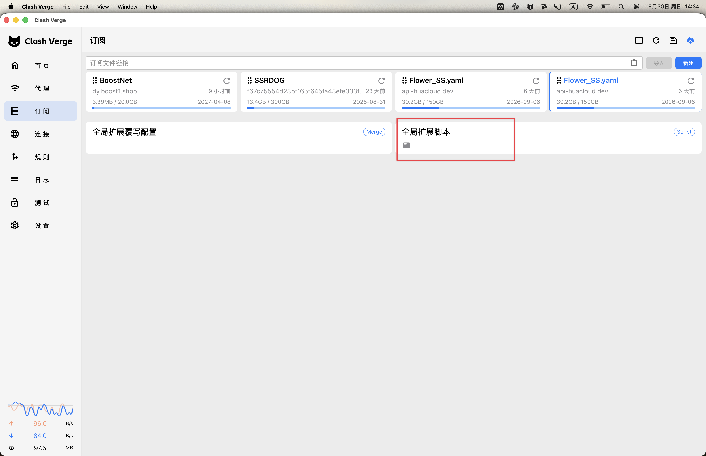

Clash Verge Rev 的订阅通常已经包含节点、策略组和规则，但订阅解决的是“机场给了什么”，不一定解决“我希望不同流量怎么走”。例如，我希望百度、微信、B 站和淘宝直接使用本地网络；普通国外网站交给机场自动测速；ChatGPT、Claude 和 Gemini 则固定从静态住宅 IP 出口访问，并在机场节点故障时自动更换前置中转，同时保持最终出口 IP 不变。

这正是全局扩展脚本适合处理的事情：订阅更新后，Clash Verge Rev 把订阅 YAML 转成一个 JavaScript `config` 对象，执行 `main(config)`，再把修改后的配置交给 Mihomo 内核。



本文基于 Clash Verge Rev 2.5.x 与 Mihomo 内核整理。脚本不是“免费节点”或“加速器”，其中的机场订阅和静态住宅 SOCKS5 需要自行准备。住宅代理也应来自合法、可信的服务商；固定出口只能减少 IP 漂移，不能保证任何平台账号绝对不会触发风控。

## 先看最终效果

启用脚本后，流量会被分成四类：

| 流量 | 命中的规则或策略 | 实际链路 | 目标网站看到的出口 IP |
|---|---|---|---|
| 局域网、回环地址 | `lanDirectRules` | 设备 → 本地目标 | 局域网地址，不经过公网代理 |
| 国内网站和国内 IP | 明确域名规则、`GEOSITE,CN`、`GEOIP,CN` | 设备 → 本地运营商 → 国内网站 | 本地宽带或移动网络的公网 IP |
| ChatGPT、Claude、Gemini | `AI_DOMAIN*` → `🤖 AI专线` | 设备 → 机场节点 → 静态住宅 SOCKS5 → AI 网站 | 静态住宅 IP |
| 其他国外网站 | 最后的 `MATCH` → `🌐 日常上网` | 设备 → 选中的机场节点 → 国外网站 | 机场节点的出口 IP |
| 广告与统计域名 | `🛑 广告拦截` | Mihomo 直接拒绝 | 不会建立外部连接 |

这里最容易混淆的是 AI 链路：机场节点只是“前置中转”，静态住宅代理才是“最后一跳”。AI 网站看到的是住宅 IP，不是机场节点 IP。

## Clash Verge Rev、Mihomo、订阅和脚本分别做什么

Clash Verge Rev 是图形界面，负责导入订阅、切换模式、控制系统代理或 TUN、编辑扩展以及展示连接和日志。真正接收连接、解析 DNS、匹配规则、建立代理隧道的是 Mihomo 内核。

一份订阅通常提供三类内容：

- `proxies`：直接写在配置里的节点。
- `proxy-providers`：由 provider 管理和更新的节点集合。
- `proxy-groups` 与 `rules`：机场预设的策略组和分流规则。

全局扩展脚本位于订阅配置与内核之间。它可以保留订阅里的机场节点，替换策略组和规则，再注入自己的 DNS、嗅探和住宅节点。官方文档给出的脚本入口也是 `main(config, profileName)`：接收由 YAML 转成的对象，修改后返回；脚本运行环境不提供网络和文件 I/O，因此所有逻辑都必须在传入的配置对象上完成。

Clash Verge Rev 的扩展执行顺序是：

```text
订阅原始配置
  ↓
全局扩展配置
  ↓
全局扩展脚本（本文）
  ↓
订阅扩展配置
  ↓
订阅扩展脚本
  ↓
Mihomo 最终配置
```

如果启用了其他订阅级扩展，它们仍可能在本文脚本之后改写结果。排查异常时，应在 Clash Verge Rev 中查看最终生效配置，而不是只检查订阅原文。

## 一次网络请求到底怎么走

以浏览器访问 `chatgpt.com` 为例，可以把链路拆成七步。

### 1. 系统代理或 TUN 把连接交给 Mihomo

系统代理模式主要接管遵循系统 HTTP/SOCKS 代理设置的程序；TUN 模式通过虚拟网卡接管范围更广，游戏、部分命令行工具和不读取系统代理的程序也更容易进入 Mihomo。

这两种模式只决定“请求怎样进内核”，进入 Mihomo 以后使用的是同一套 DNS、规则和策略组。

### 2. fake-ip 先保存域名与连接的对应关系

浏览器查询 `chatgpt.com` 时，Mihomo 的 DNS 模块不会立刻把真实 IP 原样返回，而是从 `198.18.0.0/16` 中分配一个 fake-ip，例如 `198.18.12.34`，同时保存：

```text
198.18.12.34 ↔ chatgpt.com
```

浏览器随后连接这个 fake-ip。Mihomo 接到连接后可以反查出原始域名，于是规则仍能匹配 `DOMAIN-SUFFIX,chatgpt.com`。fake-ip 不是伪装公网出口，也不会被真正发送到互联网；它只是本机内核用于保留域名上下文的一张索引卡。

### 3. 规则从上到下匹配，命中即停止

本文脚本按以下顺序生成规则：

```text
局域网与回环
  → AI 的 UDP/443 拒绝规则
  → 隐私与广告拦截
  → AI 专线域名
  → 明确的国内域名
  → Apple、Microsoft、Steam 等常见直连
  → GEOSITE/CN 与 GEOIP/CN
  → MATCH 日常上网
```

顺序就是优先级。AI 规则必须在国内 GEO 兜底之前，`MATCH` 必须在最后；否则前面的意图会被更宽泛的规则截走。

### 4. AI 规则把请求送入专线策略组

`chatgpt.com` 命中：

```text
DOMAIN-SUFFIX,chatgpt.com,🤖 AI专线（静态住宅）
```

`🤖 AI专线` 是 `select` 组，但只包含住宅节点，不包含 `DIRECT` 和机场备用。这样即使住宅代理不可用，请求也会失败，而不会悄悄换成另一个出口 IP。

这是一种刻意的 fail closed：对需要稳定出口的账号来说，“明确失败”往往比“请求成功但 IP 突然变化”更容易发现和处理。

### 5. dialer-proxy 先通过机场连接住宅代理

住宅节点带有：

```javascript
'dialer-proxy': '✈️ 前置中转'
```

它的意思不是让住宅代理再去连接机场，而是让 Mihomo 在建立“到住宅 SOCKS5 服务器”的连接时，先使用 `✈️ 前置中转` 组。完整链路是：

```text
浏览器
  ↓ 本机系统代理或 TUN
Mihomo
  ↓ 机场协议隧道
机场节点
  ↓ 连接住宅 SOCKS5 服务器
静态住宅代理
  ↓ 访问目标站点
ChatGPT / Claude / Gemini
```

Mihomo 官方对 `dialer-proxy` 的定义就是“当前代理节点通过指定的代理或策略组建立连接”。因此，目标网站只看到最后一跳住宅代理的公网 IP；本地运营商主要看到你在连接机场节点；机场节点知道下一跳是住宅代理，但在正常 HTTPS 场景下看不到端到端加密的网页正文。

代理服务商仍可能看到连接元数据，DNS 和 TLS 也不等于匿名。不要把代理链当作隐私或身份安全的绝对保证。

### 6. 前置中转只在故障时切换

`✈️ 前置中转` 使用 `fallback`，而不是 `url-test`。

- `url-test` 按健康检查延迟选择更快节点，超过 `tolerance` 后可能切换，适合日常浏览。
- `fallback` 按列表顺序使用第一个健康节点，当前节点超时才切换，适合长连接和稳定中转。

如果 AI 正在进行 SSE 流式输出，频繁更换前置节点可能导致连接中断。`fallback + lazy: false` 会持续健康检查这条链路，但无论前置机场怎么切，最后一跳仍是同一个住宅代理，所以目标站点看到的住宅出口 IP 不变。

### 7. 返回流量沿原链路回到应用

目标站点的响应先回到住宅代理，再经过机场隧道回到 Mihomo，最后交给浏览器。对应用而言，它只是建立了一条普通 TCP/TLS 连接，并不知道中间存在两层代理。

## DNS 防泄漏在防什么

“用了代理，但域名仍交给本地运营商 DNS 查询”就是常说的 DNS 泄漏。它不一定暴露网页内容，但可能暴露访问了哪些域名，也可能因为错误解析、污染或分流不一致导致连接失败。

本文 DNS 配置有四个关键点：

1. 使用 DoH，把 DNS 查询放进 HTTPS 连接。
2. `respect-rules: true` 让 DNS 连接本身也遵循路由规则。
3. 国内和私有域名优先使用 AliDNS、DNSPod，并让直连域名使用国内 DNS。
4. 默认国外 DNS 使用 Cloudflare、Google；解析机场节点自身域名时，单独使用国内 DNS，避免“代理还没连上，却要求先通过代理解析代理域名”的循环依赖。

可以把 DNS 链路简化成：

```text
国内或私有域名 → 国内 DoH → DIRECT
普通国外域名   → 国外 DoH → 按规则走日常代理
机场节点域名   → proxy-server-nameserver → 国内 DoH
```

`proxy-server-nameserver` 是 `respect-rules` 的关键配套。没有它时，解析机场域名可能产生“先有鸡还是先有蛋”的死锁。

这里的“防泄漏”是降低域名查询绕回系统 DNS 的概率，并不代表网络观察者什么都看不到。DoH 端点 IP、代理服务器 IP、连接时间和流量大小仍可能被观察到。

## 为什么 AI 要禁用 QUIC

QUIC 基于 UDP，HTTP/3 通常使用 UDP 443。很多住宅 SOCKS5 只支持 TCP，不支持 UDP ASSOCIATE。如果浏览器先尝试 QUIC，而代理链不能承载 UDP，最差情况不是立即报错，而是等待超时。

脚本在 AI 域名范围内加入：

```text
AND,((NETWORK,UDP),(DST-PORT,443),(DOMAIN-SUFFIX,chatgpt.com)),REJECT
```

`REJECT` 会立即拒绝，浏览器通常会快速回落到 TCP/TLS；`REJECT-DROP` 则静默丢包，更容易让客户端一直等到超时。规则只覆盖 AI 域名，没有一刀切屏蔽 Google、YouTube 等网站的 QUIC。

## 国内直连、国外代理如何判定

国内直连分为三层。

第一层是明确域名，例如 `baidu.com`、`bilibili.com`、`qq.com`、`taobao.com`。这类规则可读、可控，不依赖 GEO 数据是否更新。

第二层是 `GEOSITE,CN,DIRECT`。GEOSITE 按域名集合判断，适合覆盖没有手写出来的国内域名。

第三层是 `GEOIP,CN,DIRECT`。它按目标 IP 的地理库判断，用于兜住纯 IP 连接或前面没有命中的域名。本文没有给这条加 `no-resolve`，因此 Mihomo 可以为目标域名补一次真实解析后再判断目标 IP 是否在中国大陆。代价是首次连接可能多一次 DNS 查询。

如果三层都没有命中，就会落到：

```text
MATCH,🌐 日常上网（默认）
```

默认组可以在 Verge 界面中手动选 `♻️ 自动选择`、`🔯 故障转移`、`✈️ 前置中转`、住宅节点、`DIRECT` 或某个具体机场节点。默认顺序把 `♻️ 自动选择` 放在第一位，因此首次加载通常优先使用延迟较低的机场出口。

“国内”和“国外”不是永远准确的物理事实，而是由域名列表、GeoIP 数据库和规则顺序共同判断。CDN、跨国公司和新域名可能出现误判，应以 Clash Verge Rev 的连接详情为准，再补充更精确的规则。

## 脚本逐段说明

### 第 0 段：住宅节点和排除过滤器

`residentialProxies` 保存自购静态住宅 SOCKS5。`udp: false` 避免不支持 UDP 的住宅服务产生黑洞；`ip-version: ipv4` 固定使用 IPv4 建立代理连接，减少 IPv4、IPv6 出口不一致。

`EXCLUDE_PATTERN` 同时过滤住宅节点名和机场伪装成节点的流量、到期、官网等信息项。后者有时包含真实 `server/port`，健康检查甚至会通过；而 `fallback` 会按顺序选择第一个健康项，如果信息节点排在最前面，就可能长期污染前置中转。

### 第 1 段：策略组名称常量

所有策略组名字集中在 `GROUP`。规则、`dialer-proxy` 和策略组引用同一份常量，修改名称时不容易漏掉某一处。

### 第 2 段：内核基础配置

这里只写不希望交给 GUI 覆盖的字段：并发建立 TCP、统一延迟、浏览器指纹、GEO 数据自动更新、LAN 白名单以及记住策略组选择和 fake-ip 映射。

脚本刻意不写 `mode`、`allow-lan`、`ipv6`、`log-level`、`external-controller` 等 GUI 常用设置，减少扩展脚本与图形设置互相覆盖。

### 第 3 段：DNS

国内、国外 DoH 分开配置；`nameserver-policy` 为国内和 AI 域名指定解析器；`fake-ip-filter` 列出不适合 fake-ip 的局域网、NTP、连通性检测、音乐版权、Apple 推送、游戏机、STUN 和智能家居域名。

需要注意：`fake-ip-filter` 是兼容性清单，不是越长越好。加入其中的域名会返回真实 IP，失去 fake-ip 保留域名上下文的部分优势；只在确有兼容问题时增加。

### 第 4 段：流量嗅探

嗅探主要用于“程序直接连接 IP，但 TLS SNI 或 HTTP Host 里仍带有域名”的情况。`parse-pure-ip: true` 尝试从纯 IP 连接恢复域名；`override-destination: false` 默认不替换目标，仅对 HTTP 单独开启替换。

Apple、iCloud、小米推送等容易受嗅探影响的域名放进 `skip-domain`。fake-ip 场景本来就有域名映射，因此没有必要再配置宽泛的 `force-domain`。

### 第 5 段：局域网和回环

RFC 1918 私网、回环、链路本地、组播以及 IPv6 本地地址全部在最前面直连。CIDR 写死后，即使 GEO 数据还没加载，也不会把路由器、NAS、打印机或本机服务送进机场代理。

### 第 6～7 段：AI 域名与 QUIC

AI 域名通过精确域名、域名后缀和关键字三层覆盖。Cloudflare Turnstile 被放入同一出口，减少登录页面和人机验证看到不同 IP 的概率。

关键字规则覆盖面更宽，也更容易误伤。若希望最严格的边界，可以删除 `AI_KEYWORDS`，只保留确认过的精确域名和后缀。

QUIC 规则只拒绝 AI 域名的 UDP 443，迫使客户端回落 TCP，适配 `udp: false` 的住宅 SOCKS5。

### 第 8 段：广告和隐私开关

规则不直接写死 `REJECT`，而是指向 `🛑 广告拦截` 策略组。该组包含 `REJECT` 和 `DIRECT`，遇到页面功能被误伤时，可以直接在 Clash Verge Rev 界面切到 `DIRECT`，无需编辑脚本。

`googletagmanager.com` 既可能承载广告，也可能被网站用于注入功能代码，是最常见的误伤来源之一。

### 第 9～11 段：直连与兜底

明确国内站点优先，Apple、Microsoft、Steam 等按个人网络体验直连，之后才使用 GEOSITE/GEOIP 兜底。某些地区直连 Microsoft、Apple 或 Steam 的体验未必更好，这一段不是通用真理，可以按连接日志删除或改到默认策略组。

### 第 12～13 段：组装最终配置

`main()` 是整个脚本的核心，依次完成：

1. 读取订阅内联节点与 proxy provider。
2. 删除信息节点，检查订阅是否真的含机场节点。
3. 为住宅节点统一注入 `dialer-proxy`。
4. 建立默认、AI、住宅、前置中转、自动选择、故障转移和广告组。
5. 覆盖 DNS、嗅探、规则以及基础配置。
6. 删除已不再被新规则引用的 `rule-providers`。
7. 输出节点数量、被过滤项和规则数，方便在日志中核对。

这份脚本会整体替换订阅原有的 `proxy-groups` 和 `rules`。这是为了得到确定、可解释的路由结果，也意味着机场自带的流媒体解锁、游戏平台或地区策略组不会继续保留。需要这些功能时，应把相应组和规则明确合并回来。

## 使用前准备

在粘贴源码之前先完成以下设置：

1. Clash Verge Rev 右上角选择“规则”模式。
2. 进入“设置 → Clash 设置”，关闭“DNS 覆写”。否则 GUI 生成的 DNS 可能覆盖脚本中的整个 `dns`。
3. 局域网连接、IPv6、日志等级和外部控制端口继续在 Verge GUI 中设置。
4. 在“订阅”页面打开截图中的“全局扩展脚本”，粘贴源码并启用。
5. 把住宅节点里的 `server`、`port`、`username`、`password` 换成自己的真实参数。

不要把真实住宅代理账号提交到公开 Git 仓库、网盘或截图中。下面源码使用占位符，替换时也不要保留尖括号。

## 完整扩展脚本

下面是清理后的完整 JavaScript。原始粘贴内容里的 Markdown 链接、转义下划线、错位代码围栏和缺失逗号已经修正，可直接复制到全局扩展脚本编辑器。

```javascript
// ================================================================
// AI 网络增强脚本（优化版）
// 功能：AI 专线 / 国内直连 / DNS 防泄漏 / 广告拦截 / 自动测速 / 故障转移
// 适用：Clash Verge Rev 2.5.x + Mihomo 内核
// ================================================================
//
// 使用前提（重要）
// 1. Clash Verge 右上角选择「规则」模式（脚本不再强制写 mode）
// 2. 设置 → Clash 设置 →「DNS 覆写」必须保持【关闭】
//    否则 GUI 生成的 DNS 会整段覆盖本脚本的 dns 配置
// 3. 局域网连接 / IPv6 / 日志等级 / 外部控制端口，全部在 Verge GUI 里调
//    本脚本刻意不写这些字段，避免和 GUI 打架
//
// 流量走向
// - AI（Claude / ChatGPT / Gemini）→ 静态住宅 IP（经机场节点中转拨出）
// - 国内（百度 / 微信 / B 站 / 淘宝等）→ DIRECT
// - 其他国外 → 机场自动选择
// ================================================================

// ================================================================
// [0] 静态住宅 IP 节点
// ================================================================

// 两类内容必须挡在机场策略组之外：
// 1. 住宅节点，防止被误吸进机场测速组。
// 2. 机场把流量、到期时间等信息伪装成的节点。
//
// 两边共用一份定义：JS 用 RegExp 的 i flag，Mihomo 用 Go RE2 的 (?i)。
const EXCLUDE_PATTERN =
  'Traffic|Expire|剩余|到期|过期|官网|流量|重置|订阅|发布页|邀请|🏠|静态住宅|residential';

const EXCLUDE_FILTER = '(?i)' + EXCLUDE_PATTERN;
const EXCLUDE_RE = new RegExp(EXCLUDE_PATTERN, 'i');

const residentialProxies = [
  {
    name: '🏠 美国/洛杉矶',
    type: 'socks5',
    server: '<住宅代理服务器>',
    port: 1080,
    username: '<用户名>',
    password: '<密码>',
    tls: false,

    // 绝大多数住宅 SOCKS5 不支持 UDP ASSOCIATE。
    // 开着可能让 UDP 流量静默黑洞，这里主动关闭。
    udp: false,

    // 强制 IPv4，避免 IPv4/IPv6 路径下的出口 IP 不一致。
    'ip-version': 'ipv4',

    // dialer-proxy 由 main() 统一注入，不在这里写死。
  }
];

// ================================================================
// [1] 策略组名称（集中管理，避免手写字符串出错）
// ================================================================

const GROUP = {
  DEFAULT: '🌐 日常上网（默认）',
  AI: '🤖 AI专线（静态住宅）',
  RESIDENTIAL: '🏠 静态住宅IP',
  RELAY: '✈️ 前置中转',
  AUTO: '♻️ 自动选择',
  FALLBACK: '🔯 故障转移',
  ADBLOCK: '🛑 广告拦截'
};

// ================================================================
// [2] 全局基础配置：只写 Verge GUI 不负责的字段
// ================================================================

const globalConfig = {
  'tcp-concurrent': true,

  // 延迟测速扣掉握手基线，结果更接近真实体感。
  'unified-delay': true,

  'global-client-fingerprint': 'chrome',

  // GEO 数据（GEOSITE 规则依赖它）。
  'geodata-mode': true,
  'geodata-loader': 'memconservative',
  'geo-auto-update': true,
  'geo-update-interval': 24,

  // 即使 GUI 开启「局域网连接」，也只放行私有网段。
  'lan-allowed-ips': [
    '127.0.0.0/8',
    '10.0.0.0/8',
    '172.16.0.0/12',
    '192.168.0.0/16',
    '::1/128',
    'fc00::/7',
    'fe80::/10'
  ],

  profile: {
    'store-selected': true,
    'store-fake-ip': true
  }
};

// ================================================================
// [3] DNS 防泄漏
// ================================================================

// 使用 IP 字面量 DoH，省去一次 bootstrap 域名解析。
const domesticNameservers = [
  'https://223.5.5.5/dns-query', // AliDNS
  'https://1.12.12.12/dns-query' // DNSPod
];

const foreignNameservers = [
  'https://1.1.1.1/dns-query', // Cloudflare
  'https://8.8.4.4/dns-query' // Google
];

// fake-ip 模式下，命中域名规则的流量通常会把域名交给出站代理。
// 这里仍保留国外解析策略，作为强制系统解析等场景的兜底。
const forceForeignDomains = [
  '+.openai.com',
  '+.chatgpt.com',
  '+.oaistatic.com',
  '+.oaiusercontent.com',
  '+.anthropic.com',
  '+.claude.ai',
  '+.claude.com'
];

const nameserverPolicy = {
  'geosite:cn,private': domesticNameservers
};

forceForeignDomains.forEach(domain => {
  nameserverPolicy[domain] = foreignNameservers;
});

const dnsConfig = {
  enable: true,
  listen: '0.0.0.0:1053',
  ipv6: false,

  // DNS 查询本身也按规则分流：国内 DNS 直连，国外 DNS 走代理。
  'respect-rules': true,

  'use-hosts': true,
  'use-system-hosts': false,
  'cache-algorithm': 'arc',

  'enhanced-mode': 'fake-ip',
  'fake-ip-range': '198.18.0.1/16',
  'fake-ip-filter-mode': 'blacklist',

  // 只用于 bootstrap，例如解析 DoH 服务器域名。
  'default-nameserver': [
    '223.5.5.5',
    '119.29.29.29'
  ],

  nameserver: foreignNameservers,

  // 解析代理节点自身域名时使用国内 DNS。
  // 这是 respect-rules 的必要搭配，避免循环依赖。
  'proxy-server-nameserver': domesticNameservers,

  'direct-nameserver': domesticNameservers,
  'direct-nameserver-follow-policy': false,

  'nameserver-policy': nameserverPolicy,

  // 这些域名不能使用 fake-ip，否则可能破坏对应功能。
  'fake-ip-filter': [
    'geosite:private',

    '+.lan',
    '+.local',
    '*.localdomain',
    '*.localhost',
    '*.invalid',
    '+.home.arpa',

    // NTP 对时。
    '+.pool.ntp.org',
    'time.*.com',
    'time.*.apple.com',
    'ntp.*.com',
    '*.ntp.org.cn',

    // 网络连通性检测。
    '+.msftconnecttest.com',
    '+.msftncsi.com',
    'captive.apple.com',

    // 腾讯系本地回环。
    'localhost.ptlogin2.qq.com',
    'localhost.sec.qq.com',
    'localhost.work.weixin.qq.com',

    // 游戏机 / P2P / STUN。
    '+.srv.nintendo.net',
    '+.stun.playstation.net',
    'xbox.*.microsoft.com',
    'xnotify.xboxlive.com',
    '+.stun.*.*',
    '+.stun.*.*.*',
    '+.stun.*.*.*.*',
    'stun.l.google.com',

    // 音乐版权检测需要真实 IP。
    'music.163.com',
    '*.music.163.com',
    '*.126.net',
    'y.qq.com',
    '*.y.qq.com',
    'music.migu.cn',
    '*.music.migu.cn',

    // Apple 更新 / 推送。
    'mesu.apple.com',
    'swscan.apple.com',
    'swdownload.apple.com',
    '+.push.apple.com',

    // 智能家居。
    '+.mi.com',
    '+.miwifi.com',
    'Mijia Cloud'
  ]
};

// ================================================================
// [4] 嗅探
// 价值主要是给纯 IP 连接补回域名；fake-ip 下域名本来就已知。
// ================================================================

const snifferConfig = {
  enable: true,
  'force-dns-mapping': true,
  'parse-pure-ip': true,
  'override-destination': false,

  sniff: {
    TLS: {
      ports: [443, 8443]
    },
    HTTP: {
      ports: [80, '8080-8880'],
      'override-destination': true
    },
    QUIC: {
      ports: [443, 8443]
    }
  },

  'skip-domain': [
    '+.apple.com',
    '+.icloud.com',
    '+.mzstatic.com',
    '+.push.apple.com',
    'Mijia Cloud',
    'dlg.io.mi.com'
  ]
};

// ================================================================
// [5] 局域网 / 回环：必须是第一批规则
// ================================================================

const lanDirectRules = [
  'DOMAIN-SUFFIX,local,DIRECT',
  'DOMAIN-SUFFIX,localhost,DIRECT',
  'DOMAIN-SUFFIX,home.arpa,DIRECT',
  'DOMAIN-SUFFIX,in-addr.arpa,DIRECT',
  'DOMAIN-SUFFIX,ip6.arpa,DIRECT',

  // 写死 CIDR，不依赖 GEO 数据是否已经加载。
  'IP-CIDR,127.0.0.0/8,DIRECT,no-resolve',
  'IP-CIDR,10.0.0.0/8,DIRECT,no-resolve',
  'IP-CIDR,172.16.0.0/12,DIRECT,no-resolve',
  'IP-CIDR,192.168.0.0/16,DIRECT,no-resolve',
  'IP-CIDR,169.254.0.0/16,DIRECT,no-resolve',
  'IP-CIDR,224.0.0.0/4,DIRECT,no-resolve',
  'IP-CIDR6,::1/128,DIRECT,no-resolve',
  'IP-CIDR6,fc00::/7,DIRECT,no-resolve',
  'IP-CIDR6,fe80::/10,DIRECT,no-resolve',

  'GEOIP,lan,DIRECT,no-resolve'
];

// ================================================================
// [6] AI 专线域名
// ================================================================

const AI_DOMAINS = [
  // Turnstile 人机验证尽量与 AI 主站保持相同出口 IP。
  'challenges.cloudflare.com'
];

// 不要添加 DOMAIN-SUFFIX,auth0.com：Auth0 是通用身份服务，
// 会把大量无关网站的登录流量送入住宅 IP。
const AI_DOMAIN_SUFFIXES = [
  // Anthropic / Claude。
  'anthropic.com',
  'anthropic.systems',
  'claude.ai',
  'claude.com',
  'claudeusercontent.com',

  // OpenAI / ChatGPT。
  'openai.com',
  'chatgpt.com',
  'oaistatic.com',
  'oaiusercontent.com',
  'sora.com',

  // Gemini；其余 Google AI 域名按需解注释。
  'gemini.google.com'
  // 'aistudio.google.com',
  // 'generativelanguage.googleapis.com',
  // 'ai.google.dev',
  // 'perplexity.ai',
  // 'poe.com',
  // 'openrouter.ai',
  // 'cursor.com',
  // 'cursor.sh'
];

const AI_KEYWORDS = [
  'claude',
  'openai',
  'chatgpt',
  'gemini'
];

const aiRules = [
  ...AI_DOMAINS.map(domain => `DOMAIN,${domain},${GROUP.AI}`),
  ...AI_DOMAIN_SUFFIXES.map(domain => `DOMAIN-SUFFIX,${domain},${GROUP.AI}`),
  ...AI_KEYWORDS.map(keyword => `DOMAIN-KEYWORD,${keyword},${GROUP.AI}`)
];

// ================================================================
// [7] 禁用 AI 域名的 QUIC
// 住宅 SOCKS5 不支持 UDP 时，拒绝 UDP/443 让浏览器立即回落 TCP。
// ================================================================

const QUIC_BLOCK_SUFFIXES = [
  'openai.com',
  'chatgpt.com',
  'anthropic.com',
  'claude.ai',
  'claude.com'
];

// NETWORK,UDP 放在逻辑规则前面，让 TCP 连接尽快短路。
const quicRejectRules = QUIC_BLOCK_SUFFIXES.map(
  domain =>
    `AND,((NETWORK,UDP),(DST-PORT,443),(DOMAIN-SUFFIX,${domain})),REJECT`
);

// ================================================================
// [8] 广告 / 隐私拦截
// 指向策略组而不是写死 REJECT，便于在 Verge 中一键关闭。
// ================================================================

const privacyRejectRules = [
  'DOMAIN-SUFFIX,usefathom.com,' + GROUP.ADBLOCK,
  'DOMAIN-SUFFIX,sentry.io,' + GROUP.ADBLOCK,
  'DOMAIN-SUFFIX,ingest.sentry.io,' + GROUP.ADBLOCK
];

const adBlockRules = [
  'DOMAIN-SUFFIX,doubleclick.net,' + GROUP.ADBLOCK,
  'DOMAIN-SUFFIX,googleadservices.com,' + GROUP.ADBLOCK,
  'DOMAIN-SUFFIX,googlesyndication.com,' + GROUP.ADBLOCK,
  'DOMAIN-SUFFIX,googletagservices.com,' + GROUP.ADBLOCK,
  'DOMAIN-SUFFIX,adnxs.com,' + GROUP.ADBLOCK,
  'DOMAIN-SUFFIX,adsrvr.org,' + GROUP.ADBLOCK,
  'DOMAIN-SUFFIX,scorecardresearch.com,' + GROUP.ADBLOCK,
  'DOMAIN-SUFFIX,criteo.com,' + GROUP.ADBLOCK,

  // 某些站点使用 GTM 注入功能性代码；页面异常时先注释这条。
  'DOMAIN-SUFFIX,googletagmanager.com,' + GROUP.ADBLOCK
];

// ================================================================
// [9] 国内直连
// ================================================================

const domesticDirectRules = [
  // 百度。
  'DOMAIN-SUFFIX,baidu.com,DIRECT',
  'DOMAIN-SUFFIX,bdstatic.com,DIRECT',

  // B 站。
  'DOMAIN-SUFFIX,bilibili.com,DIRECT',
  'DOMAIN-SUFFIX,bilivideo.com,DIRECT',
  'DOMAIN-SUFFIX,hdslb.com,DIRECT',
  'DOMAIN-SUFFIX,acgvideo.com,DIRECT',

  // 腾讯。
  'DOMAIN-SUFFIX,qq.com,DIRECT',
  'DOMAIN-SUFFIX,wechat.com,DIRECT',
  'DOMAIN-SUFFIX,tenpay.com,DIRECT',
  'DOMAIN-SUFFIX,gtimg.com,DIRECT',

  // 阿里。
  'DOMAIN-SUFFIX,taobao.com,DIRECT',
  'DOMAIN-SUFFIX,tmall.com,DIRECT',
  'DOMAIN-SUFFIX,alicdn.com,DIRECT',
  'DOMAIN-SUFFIX,aliyun.com,DIRECT',
  'DOMAIN-SUFFIX,alipay.com,DIRECT',

  // 字节。
  'DOMAIN-SUFFIX,douyin.com,DIRECT',
  'DOMAIN-SUFFIX,iesdouyin.com,DIRECT',
  'DOMAIN-SUFFIX,byteimg.com,DIRECT',
  'DOMAIN-SUFFIX,bytedance.com,DIRECT',
  'DOMAIN-SUFFIX,ixigua.com,DIRECT',
  'DOMAIN-SUFFIX,feishu.cn,DIRECT',

  // 其他。
  'DOMAIN-SUFFIX,jd.com,DIRECT',
  'DOMAIN-SUFFIX,mi.com,DIRECT',
  'DOMAIN-SUFFIX,xiaohongshu.com,DIRECT',
  'DOMAIN-SUFFIX,zhihu.com,DIRECT',
  'DOMAIN-SUFFIX,weibo.com,DIRECT',
  'DOMAIN-SUFFIX,163.com,DIRECT',
  'DOMAIN-SUFFIX,126.net,DIRECT'
];

// ================================================================
// [10] 常见服务直连
// ================================================================

const commonDirectRules = [
  'DOMAIN-SUFFIX,apple.com,DIRECT',
  'DOMAIN-SUFFIX,icloud.com,DIRECT',
  'DOMAIN-SUFFIX,itunes.com,DIRECT',
  'DOMAIN-SUFFIX,mzstatic.com,DIRECT',
  'DOMAIN-SUFFIX,cdn-apple.com,DIRECT',

  'DOMAIN-SUFFIX,microsoft.com,DIRECT',
  'DOMAIN-SUFFIX,windowsupdate.com,DIRECT',
  'DOMAIN-SUFFIX,office.com,DIRECT',

  'DOMAIN-SUFFIX,steamcontent.com,DIRECT',
  'DOMAIN-SUFFIX,steamserver.net,DIRECT'
];

// ================================================================
// [11] 兜底直连：放在所有明确规则之后
// ================================================================

const geoDirectRules = [
  'GEOSITE,CN,DIRECT',

  // 刻意不加 no-resolve，以便兜住纯 IP 直连国内服务的场景。
  // 如果更在意首次解析延迟，可改成 GEOIP,CN,DIRECT,no-resolve。
  'GEOIP,CN,DIRECT'
];

// ================================================================
// [12] 工具函数
// ================================================================

function unique(arr) {
  return [...new Set(arr.filter(Boolean))];
}

// ================================================================
// [13] 主函数
// ================================================================

function main(config) {
  config.proxies = config.proxies || [];

  const residentialProxyNames = residentialProxies.map(proxy => proxy.name);

  // 订阅里的机场节点（内联形式）。
  const inlineProxies = config.proxies.filter(
    proxy =>
      proxy &&
      proxy.name &&
      !residentialProxyNames.includes(proxy.name)
  );

  // 剔除机场的流量、到期等信息节点。
  const airportProxies = inlineProxies.filter(
    proxy => !EXCLUDE_RE.test(proxy.name)
  );

  const junkProxyNames = inlineProxies
    .filter(proxy => EXCLUDE_RE.test(proxy.name))
    .map(proxy => proxy.name);

  const airportProxyNames = airportProxies.map(proxy => proxy.name);

  // 同时支持 proxy-provider 形式的订阅。
  const providerNames = Object.keys(config['proxy-providers'] || {});

  if (airportProxyNames.length === 0 && providerNames.length === 0) {
    throw new Error(
      '错误：订阅中未找到任何机场节点（既无 proxies 也无 proxy-providers）。' +
      '静态住宅 IP 需要通过「前置中转」拨出。'
    );
  }

  // 住宅节点统一注入 dialer-proxy。
  const fixedResidentialProxies = residentialProxies.map(proxy => ({
    ...proxy,
    'dialer-proxy': GROUP.RELAY
  }));

  config.proxies = [...airportProxies, ...fixedResidentialProxies];

  // 生成一个只包含机场节点的策略组。
  const airportGroup = base => {
    const group = { ...base };

    if (airportProxyNames.length) {
      group.proxies = airportProxyNames;
    }

    if (providerNames.length) {
      group['include-all-providers'] = true;
      group['exclude-filter'] = EXCLUDE_FILTER;
    }

    return group;
  };

  const HEALTH_CHECK = {
    url: 'https://www.gstatic.com/generate_204',
    interval: 300,
    timeout: 3000,
    'max-failed-times': 3,
    'expected-status': 204
  };

  config['proxy-groups'] = [
    {
      name: GROUP.DEFAULT,
      type: 'select',
      proxies: unique([
        GROUP.AUTO,
        GROUP.FALLBACK,
        GROUP.RELAY,
        GROUP.RESIDENTIAL,
        'DIRECT',
        ...airportProxyNames
      ]),
      ...(providerNames.length
        ? {
            'include-all-providers': true,
            'exclude-filter': EXCLUDE_FILTER
          }
        : {})
    },

    {
      name: GROUP.AI,
      type: 'select',

      // 只放住宅节点，不放 DIRECT 和机场备用。
      // AI 流量宁可失败，也不偷偷更换最终出口 IP。
      proxies: residentialProxyNames
    },

    {
      name: GROUP.RESIDENTIAL,
      type: 'select',
      proxies: residentialProxyNames
    },

    // 中转层：只在当前机场节点故障时切换。
    airportGroup({
      name: GROUP.RELAY,
      type: 'fallback',
      lazy: false,
      ...HEALTH_CHECK
    }),

    // 日常浏览：延迟优先。
    airportGroup({
      name: GROUP.AUTO,
      type: 'url-test',
      tolerance: 100,
      lazy: true,
      ...HEALTH_CHECK
    }),

    // 手动备选。
    airportGroup({
      name: GROUP.FALLBACK,
      type: 'fallback',
      lazy: true,
      ...HEALTH_CHECK
    }),

    // 广告拦截开关。
    {
      name: GROUP.ADBLOCK,
      type: 'select',
      proxies: ['REJECT', 'DIRECT']
    }
  ];

  Object.assign(config, globalConfig);

  config.dns = dnsConfig;
  config.sniffer = snifferConfig;

  // 新规则不再引用订阅自带的 rule-providers，清理可减少下载和内存占用。
  delete config['rule-providers'];

  // 规则顺序就是优先级：从上到下匹配，命中即停止。
  config.rules = [
    // 1. 局域网 / 回环。
    ...lanDirectRules,

    // 2. AI 域名禁用 QUIC，强制回落 TCP。
    ...quicRejectRules,

    // 3. 隐私 / 广告。
    ...privacyRejectRules,
    ...adBlockRules,

    // 4. AI 专线，必须在 GEOSITE,CN 之前。
    ...aiRules,

    // 5. 明确的国内直连。
    ...domesticDirectRules,

    // 6. 常见服务直连。
    ...commonDirectRules,

    // 7. GEO 兜底直连。
    ...geoDirectRules,

    // 8. 其余国外流量。
    `MATCH,${GROUP.DEFAULT}`
  ];

  console.log('✅ AI 增强版配置已加载');
  console.log(
    `   机场节点：${airportProxyNames.length} 个内联 / ` +
    `${providerNames.length} 个 provider`
  );

  if (junkProxyNames.length) {
    console.log(
      `   已剔除信息节点 ${junkProxyNames.length} 个：` +
      junkProxyNames.join(' / ')
    );
  }

  console.log(`   规则条数：${config.rules.length}`);
  console.log(
    '   AI → 静态住宅 IP（经前置中转） | ' +
    '国内 → DIRECT | 其他 → 自动选择'
  );

  return config;
}
```

## 如何验证是否真的生效

先在 Clash Verge Rev 日志中确认出现：

```text
✅ AI 增强版配置已加载
机场节点：N 个内联 / N 个 provider
规则条数：N
```

然后在“代理”页面检查以下策略组：

- `🤖 AI专线（静态住宅）` 中只应出现住宅节点。
- `🏠 静态住宅IP` 中只应出现住宅节点。
- `✈️ 前置中转`、`♻️ 自动选择`、`🔯 故障转移` 中不应出现住宅节点、流量信息或到期信息。
- `🛑 广告拦截` 默认选择 `REJECT`。

访问 AI 网站后，再到“连接”页面查看命中的规则和链路。AI 请求应指向 `🤖 AI专线`，链路中应同时出现住宅节点和前置机场节点；百度、B 站等请求应显示 `DIRECT`；其他国外网站应进入 `🌐 日常上网`。

不要直接打开普通 IP 查询网站来判断 AI 出口：`ipinfo.io`、`ipify.org` 等域名默认属于“其他国外流量”，看到的会是机场出口。若要验证住宅 IP，可以临时把某个 IP 查询域名加入 `AI_DOMAIN_SUFFIXES`，确认后立即删除这条测试规则。

DNS 可以用下面的命令检查本机监听与 fake-ip：

```bash
dig @127.0.0.1 -p 1053 chatgpt.com
```

正常情况下会得到 `198.18.0.0/16` 中的地址。这个结果只能证明 fake-ip 工作，不能单独证明国外 DoH 已经通过代理；DNS 的实际出站还要结合 Mihomo 日志和连接详情判断。

## 常见问题

### 粘贴以后配置加载失败

先确认住宅节点参数已经替换，`port` 是数字而不是字符串或 `xx`，对象字段之间有逗号，URL 没有被 Markdown 转成 `[文字](链接)`。本文代码块已经修复了这些格式问题。

### AI 能打开，但流式回答经常中断

检查 `✈️ 前置中转` 是否误选了信息节点，健康检查地址是否可访问，以及机场节点是否频繁掉线。前置组应使用 `fallback`，不建议改成高频切换的 `url-test`。

### AI 网站一直转圈或登录验证循环

检查主站、认证域名、静态资源和 `challenges.cloudflare.com` 是否都命中 AI 组；再确认浏览器没有启用绕过系统代理的独立 Secure DNS、VPN 扩展或其他网络工具。登录链路中不同域名使用不同出口，容易被平台视为环境变化。

### 国内网站反而变慢

在连接页面查看它命中的具体规则。若落入 `MATCH`，补充精确的 `DOMAIN-SUFFIX`；若 `GEOIP,CN` 触发了额外解析且更在意首连延迟，可以改成 `GEOIP,CN,DIRECT,no-resolve`，但纯 IP 国内连接可能因此走到默认代理。

### 某些页面关闭广告后才能正常显示

先把 `🛑 广告拦截` 切换为 `DIRECT` 验证。如果恢复正常，优先注释 `googletagmanager.com`，然后按连接日志逐条缩小误伤规则。生产级广告过滤更适合使用持续维护的 rule-set，而不是无限扩充手写域名。

### 机场订阅更新后脚本失效

全局扩展脚本会在订阅配置更新后重新执行，理论上不会因更新消失。若节点变空，检查机场是否从内联 `proxies` 改成了 `proxy-providers`、provider 是否加载失败，以及节点名称是否被 `EXCLUDE_PATTERN` 误过滤。

## 这套设计的边界

这份脚本的重点不是塞入最多规则，而是把出口职责分清：本地网络负责国内，机场负责普通国外访问，住宅代理只负责需要稳定出口的 AI 服务。前置中转可以变化，最终住宅出口保持稳定；规则和策略组也能在 Clash Verge Rev 中直接观察。

但它仍有明确边界：域名会变化，GEO 数据会更新，机场和住宅服务会故障，平台风控也不只看 IP。把连接日志、最终配置和实际出口验证纳入日常检查，比把任何一份脚本当成永久正确的“万能配置”更可靠。

## 参考文档

- [Clash Verge Rev：扩展配置与执行顺序](https://www.clashverge.dev/guide/extend.html)
- [Clash Verge Rev：自定义扩展脚本](https://www.clashverge.dev/guide/script.html)
- [Mihomo：代理节点通用字段与 dialer-proxy](https://wiki.metacubex.one/config/proxies/)
- [Mihomo：dialer-proxy 链式代理](https://wiki.metacubex.one/config/proxies/dialer-proxy/)
- [Mihomo：策略组通用字段](https://wiki.metacubex.one/config/proxy-groups/)
- [Mihomo：fallback 策略组](https://wiki.metacubex.one/config/proxy-groups/fallback/)
- [Mihomo：DNS 配置](https://wiki.metacubex.one/config/dns/)
- [Mihomo：路由规则与逻辑规则](https://wiki.metacubex.one/config/rules/)
