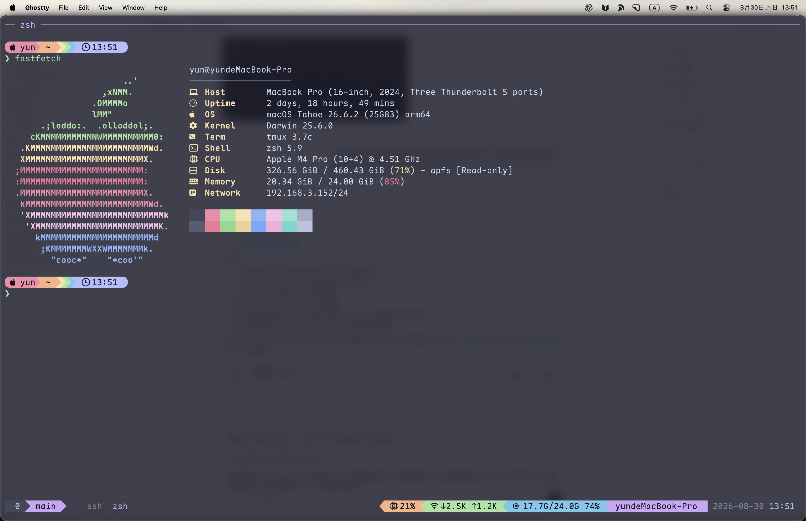

我用了很长时间的 iTerm2，最后还是把日常终端换成了 Ghostty。原因不是 iTerm2 不好，而是我的终端工作流已经逐渐收敛到 `Ghostty + zsh + tmux`：Ghostty 负责快速渲染和原生窗口，tmux 负责会话与窗口状态，shell 和命令行工具负责其余事情。



本文使用的是 Ghostty 1.3.1。Ghostty 更新很快，配置项发生变化时，可以运行 `ghostty +show-config --default --docs` 查看当前版本内置的完整说明。

## Ghostty 是什么

Ghostty 是一个开源、跨平台的终端模拟器，由 Zig 编写核心部分。它的目标不是只追求跑分，而是同时提供高性能、标准兼容、平台原生界面和常用的窗口功能。

在 macOS 上，Ghostty 使用 SwiftUI 构建原生应用界面，用 CoreText 处理字体，用 Metal 渲染终端；Linux 版本使用 GTK 和 OpenGL，并同时支持 Wayland 与 X11。窗口、标签页和分屏使用平台原生交互，终端解析和渲染核心则可以跨平台复用。

## Ghostty 为什么性能好

Ghostty 快，不是因为某一个“GPU 加速”开关，而是整体架构从一开始就围绕低延迟和高吞吐设计。

### 每个终端都有独立的读、写和渲染线程

Ghostty 为每个终端 surface 分配专门的读取、写入和渲染线程。大量输出到达时，PTY 读取、终端状态更新和画面渲染可以并行推进，不需要全部挤在 UI 主线程中。

这类架构在运行构建日志、查看大文件或让 AI 编程工具持续输出时尤其明显：窗口交互不容易被大量文本拖住，一个标签页繁忙时也更少影响其他终端。

### Metal 与 OpenGL 渲染

macOS 版本使用 Metal，Linux 版本使用 OpenGL。GPU 负责字形、颜色、光标和终端网格的合成，CPU 不需要反复完成整块画面的软件绘制。

不过，不能简单理解成“Ghostty 有 GPU，所以一定比 iTerm2 快”。现代 iTerm2 也有 GPU/Metal 渲染能力。Ghostty 的优势来自线程模型、渲染管线、终端解析器和数据结构共同作用，而不是单独一个技术名词。

### SIMD 优化的终端解析器

终端收到的是一连串普通字符和控制序列。Ghostty 的读取线程包含经过优化的解析器，并使用 CPU 的 SIMD 指令批量处理数据。输出量越大，这类底层优化越容易体现价值。

### Zig 与 ReleaseFast 构建

Ghostty 的核心使用 Zig 编写，能够精确控制内存布局、线程和平台接口。正式版本使用 `ReleaseFast` 优化构建，减少调试检查和运行时开销。本文所用 macOS 版本的构建信息就是 `ReleaseFast + Metal + CoreText + kqueue`。

Ghostty 项目在自己的基准测试中将它归入高性能终端一档，并声称某些吞吐测试中比传统终端快很多。不过终端的真实体验还会受字体、shader、透明效果、屏幕分辨率、tmux 和前台程序影响，因此不应该把单项跑分理解成所有电脑上固定的倍数。

## 为什么把 iTerm2 换成 Ghostty

iTerm2 功能成熟，Profile、Trigger、自动化和各种边角功能都很完整。如果这些能力是工作流核心，没有必要为了“新”而换终端。

我选择 Ghostty，主要是下面几个原因。

### 日常交互更轻快

启动、创建窗口、切换终端和面对持续输出时，Ghostty 的响应很直接。尤其在 Claude Code、构建日志和 tmux 同时工作的场景中，我更看重输入和画面跟手，而不是终端自带大量工作流功能。

### 配置是一个可以版本化的文本文件

Ghostty 使用简单的 `key = value` 配置。字体、主题、窗口、快捷键和行为都能集中在一个文件里，迁移电脑时复制配置即可，也很适合放进自己的 dotfiles。

### 原生窗口与简洁界面

Ghostty 在 macOS 上不是把跨平台 UI 强行套进窗口，而是使用原生应用层。隐藏标题栏后，界面只剩终端内容；需要标签页和分屏时仍然可以使用系统熟悉的快捷键。

### 我已经把状态管理交给 tmux

iTerm2 的窗口恢复对我不再重要，因为 shell 会话、窗口和 pane 都由 tmux 保存。Ghostty 只需要在冷启动时 attach 到固定 tmux session，并提供几个干净的 zsh 窗口作为逃生口。

### Quick Terminal 很适合临时操作

Ghostty 的 Quick Terminal 类似从屏幕边缘滑出的下拉终端。设置全局快捷键后，不管当前在哪个应用，都能快速打开一个终端，执行完命令再收起。

迁移之后，我失去的是 iTerm2 更庞大的 GUI 配置和自动化生态，得到的是更小、更清晰的职责边界：Ghostty 管显示，tmux 管会话，zsh 管命令环境。对我的工作流来说，这个交换是值得的。

## 安装 Ghostty

### macOS：使用 Homebrew

最省事的方式是安装 Homebrew cask：

```bash
brew install --cask ghostty
```

安装完成后，从 Applications 或 Spotlight 打开 Ghostty。Homebrew cask 由社区维护，但重新打包的是 Ghostty 官方签名并公证的 DMG。

### macOS：使用官方 DMG

也可以从 [Ghostty 下载页面](https://ghostty.org/download)下载安装包，打开 `.dmg`，再把 Ghostty 拖入 Applications。Ghostty 官方目前只直接发布 macOS 预编译包。

### Linux

Linux 版本主要由各发行版或社区提供。安装前建议先查看 [Ghostty 官方包列表](https://ghostty.org/docs/install/binary)，以下是常见方式：

```bash
# Arch Linux
sudo pacman -S ghostty

# Ubuntu 26.04 及以上
sudo apt install ghostty

# Alpine Linux testing
sudo apk add ghostty

# Snap
sudo snap install ghostty --classic
```

发行版没有可用包时，可以按照官方文档从源码构建。Ghostty 1.3.x 需要 Zig 0.15.2，正式构建使用：

```bash
zig build -Doptimize=ReleaseFast
```

## 配置文件与重载

在 macOS 上按 `Cmd + ,` 可以直接打开当前配置文件。Ghostty 1.3.1 的 macOS 配置文件通常是：

```text
~/Library/Application Support/com.mitchellh.ghostty/config.ghostty
```

保存以后按：

```text
Cmd + Shift + ,
```

即可执行 `reload_config`。也可以在命令行检查当前生效的非默认配置：

```bash
ghostty +show-config --changes-only
```

查看全部配置项和内置说明：

```bash
ghostty +show-config --default --docs
```

不是所有配置都能完整热更新。例如 macOS 的背景透明度、Quick Terminal 位置需要完全重启 Ghostty，窗口 padding 和标题栏样式通常只对新窗口生效。修改后没有变化时，先关闭全部窗口并重新启动。

## 我的配置思路

这份配置围绕四个目标：终端内容清晰、界面尽量少、随时能拉出 Quick Terminal，以及启动后自动回到 tmux。

### 图标、字体与主题

```ini
macos-icon = chalkboard
font-family = "Maple Mono NF CN"
font-size = 18
theme = Catppuccin Mocha
```

- `macos-icon = chalkboard`：使用 Ghostty 官方提供的黑板风格图标，只影响 macOS Dock、启动台和应用切换器中的图标。
- `font-family`：使用 Maple Mono NF CN。它同时照顾编程字符、Nerd Font 图标和中文显示；复制配置前需要先安装这款字体。
- `font-size = 18`：字体大小单位是 point，在 Retina 屏幕上会按 DPI 换算为像素。
- `theme = Catppuccin Mocha`：使用暗色 Catppuccin 主题。Ghostty 1.3.1 已经内置该主题，无需单独下载；可以运行 `ghostty +list-themes` 查看全部主题。

### 透明、模糊和窗口外观

```ini
background-opacity = 0.85
background-blur = 30
macos-titlebar-style = hidden
window-padding-x = 10
window-padding-y = 8
window-save-state = never
window-theme = auto
```

- `background-opacity = 0.85`：背景不透明度为 85%，数值越小越透明。
- `background-blur = 30`：透明背景后的模糊强度。旧版字段 `background-blur-radius` 在当前版本仍会通过兼容层映射，但新配置推荐使用 `background-blur`。
- `macos-titlebar-style = hidden`：隐藏标题栏，因此长在标题栏里的 tab 栏也一起消失。窗口边框还在；需要拖动窗口时，可以按住 Option 点击并拖动可调整大小的边缘。
- `window-padding-x/y`：终端网格与窗口边缘之间分别留 10pt 横向、8pt 纵向空白。运行时重载通常只影响新建窗口、tab 或 split。
- `window-save-state = never`：不让 macOS 恢复上次的窗口、tab 和 split，避免恢复出来的 surface 绕过 `initial-command`。
- `window-theme = auto`：根据终端背景判断窗口使用浅色还是深色外观。标题栏隐藏后它不太显眼，但仍会影响 Ghostty 的非终端窗口。

### 光标与 shader

```ini
cursor-style = bar
cursor-style-blink = true
cursor-opacity = 0.9
custom-shader = ~/.config/ghostty/shaders/cursor_smear.glsl
```

- `cursor-style = bar`：默认使用竖线光标。shell 或应用仍可以通过终端控制序列临时覆盖它。
- `cursor-style-blink = true`：默认开启闪烁；应用仍可通过 `DECSCUSR` 改变状态。
- `cursor-opacity = 0.9`：光标保持 90% 不透明，略微融入整体主题。
- `custom-shader`：加载 GLSL shader，为光标增加拖影效果。配置路径支持展开 `~`，但 shader 文件本身需要提前存在。

自定义 shader 在终端聚焦时默认运行动画循环，会增加一些 GPU 和 CPU 消耗。Ghostty 官方文档给出的通常开销是低于 10%，但实际取决于 shader、终端数量和分辨率。遇到黑屏、发热或掉帧时，先注释这一行排查。

### 鼠标、复制与清晰选区

```ini
mouse-hide-while-typing = true
copy-on-select = clipboard
mouse-shift-capture = false
selection-background = #585b70
selection-foreground = #cdd6f4
```

- `mouse-hide-while-typing = true`：输入时立即隐藏鼠标，移动或点击后重新出现。
- `copy-on-select = clipboard`：选中文本后直接写入系统剪贴板，不需要再按 `Cmd + C`。
- `mouse-shift-capture = false`：应用开启鼠标上报时，按住 Shift 拖动不会把 Shift 发送给应用，而是由 Ghostty 自己创建选区。应用仍可通过 `XTSHIFTESCAPE` 临时覆盖；如果希望任何应用都不能抢走 Shift 选区，可以改成 `never`。
- `selection-background/foreground`：明确指定深色选区背景和浅色文字。无论原文使用什么 ANSI 颜色，Ghostty 自己绘制选区时都能保持可读。

这组设置对 Claude Code、tmux 和 Vim 很重要。它们开启鼠标上报以后，普通拖动会交给应用；按住 Shift 拖动就是回到 Ghostty 原生选区的“逃生口”。

### Quick Terminal 与右 Option

```ini
quick-terminal-position = top
macos-option-as-alt = right
keybind = global:super+f12=toggle_quick_terminal
```

- `quick-terminal-position = top`：Quick Terminal 从屏幕顶部出现。这个位置在 macOS 上需要完全重启 Ghostty 才能更新。
- `macos-option-as-alt = right`：只有右 Option 被当作终端的 Alt/Meta，方便输入 tmux 的 `M-` 系列快捷键；左 Option 仍保留 macOS Unicode 输入能力。
- `global:super+f12`：把 `Cmd + F12` 绑定为系统全局 Quick Terminal 开关。`super` 在 macOS 上就是 Command；`global:` 让快捷键在 Ghostty 没有聚焦时也能使用。

首次添加 `global:` 快捷键时，macOS 会要求 Ghostty 获得“系统设置 → 隐私与安全性 → 辅助功能”权限。原配置如果写成 `keybind = super+f12=toggle_quick_terminal`，快捷键只会在 Ghostty 自己收到按键时触发，并不是真正的全局快捷键。

### 启动进入 tmux

```ini
confirm-close-surface = false
initial-command = /Users/yun/.config/tmux/bin/ghostty-boot
quit-after-last-window-closed = true
```

- `confirm-close-surface = false`：关闭窗口、tab 或 split 时不再确认。配合 tmux 很方便，但没有 tmux 保护的前台进程也会被直接关闭。
- `initial-command`：只在 Ghostty 进程启动后创建的第一个 surface 中运行 `ghostty-boot`。新窗口、新 tab 和 Quick Terminal 仍然使用默认 `command`，也就是干净的 zsh。
- `quit-after-last-window-closed = true`：关闭最后一个窗口后退出整个 Ghostty 进程。下次从 Dock 打开会重新冷启动，于是 `initial-command` 会再次执行。

这里把状态持久化完全交给 tmux。`ghostty-boot` 负责 attach 或创建名为 `main` 的 session；退出 tmux 后回到 shell。`window-save-state = never` 则阻止 Ghostty 恢复额外窗口，否则恢复出来的 surface 会走默认 `command`，焦点还可能落在它们身上，看起来就像没有进入 tmux。

`initial-command` 写绝对路径最稳妥。单独写一个以 `~/` 开头、没有额外参数的命令不一定会经过 shell 展开；绝对路径也能避免 GUI 启动时 PATH 与交互式 zsh 不一致。

## 完整配置

下面是整理后的可复制版本。相比原配置有两个小调整：把兼容旧名 `background-blur-radius` 改成当前字段 `background-blur`，并为 Quick Terminal 快捷键加上 `global:` 前缀。

```ini
# 重载配置：Cmd + Shift + ,
# 打开配置：Cmd + ,

# ========================================================
# Application
# ========================================================

# Ghostty 官方黑板风格图标
macos-icon = chalkboard

# ========================================================
# Typography
# ========================================================

font-family = "Maple Mono NF CN"
font-size = 18
# adjust-cell-height = 1

# ========================================================
# Theme and Colors
# ========================================================

theme = Catppuccin Mocha
# theme = Catppuccin Latte

# ========================================================
# Window and Appearance
# ========================================================

background-opacity = 0.85
background-blur = 30

# 隐藏标题栏，tab 栏也会一起隐藏
macos-titlebar-style = hidden
window-padding-x = 10
window-padding-y = 8

# 不恢复 Ghostty 窗口状态，状态持久化交给 tmux
window-save-state = never
window-theme = auto

# ========================================================
# Cursor
# ========================================================

cursor-style = bar
cursor-style-blink = true
cursor-opacity = 0.9

# 光标轨迹 shader
custom-shader = ~/.config/ghostty/shaders/cursor_smear.glsl

# ========================================================
# Mouse and Selection
# ========================================================

mouse-hide-while-typing = true
copy-on-select = clipboard

# 应用开启鼠标上报时，保留 Shift + 拖动作为 Ghostty 原生选区
mouse-shift-capture = false

# Catppuccin Mocha：深色选区背景 + 浅色文字
selection-background = #585b70
selection-foreground = #cdd6f4

# ========================================================
# Quick Terminal and Keyboard
# ========================================================

quick-terminal-position = top

# 只有右 Option 作为 Alt，左 Option 保留给 macOS Unicode 输入
macos-option-as-alt = right

# 全局 Cmd + F12 显示或隐藏 Quick Terminal
keybind = global:super+f12=toggle_quick_terminal

# ========================================================
# Behavior and tmux
# ========================================================

confirm-close-surface = false

# 只让冷启动创建的第一个 surface 自动进入 tmux
# 新窗口、tab 和 Quick Terminal 仍使用默认 zsh
initial-command = /Users/yun/.config/tmux/bin/ghostty-boot

# 关闭最后一个窗口时退出 Ghostty；下次启动会再次执行 initial-command
quit-after-last-window-closed = true
```

复制后至少需要修改两处：确认已经安装 `Maple Mono NF CN`，并把 `initial-command` 改成自己机器上的启动脚本绝对路径。如果不使用 tmux，删除 `initial-command`、`window-save-state` 和 `quit-after-last-window-closed` 这三行即可。

## 最后

从 iTerm2 切换到 Ghostty，不是把一个“慢终端”换成一个“快终端”这么简单。更准确地说，是把终端工作流重新分层：Ghostty 提供高性能渲染和原生窗口，tmux 保存长生命周期会话，纯文本配置负责复现环境。

如果你依赖 iTerm2 的 Profile、Trigger 和深度自动化，继续使用 iTerm2 完全合理；如果你更喜欢配置即代码、tmux 和简洁的原生终端，Ghostty 值得尝试。

参考：[Ghostty 官方文档](https://ghostty.org/docs)、[Ghostty 性能与架构说明](https://github.com/ghostty-org/ghostty/blob/main/README.md)、[安装 Ghostty](https://ghostty.org/docs/install/binary)、[Ghostty 配置参考](https://ghostty.org/docs/config/reference)、[Ghostty 快捷键参考](https://ghostty.org/docs/config/keybind/reference)。
