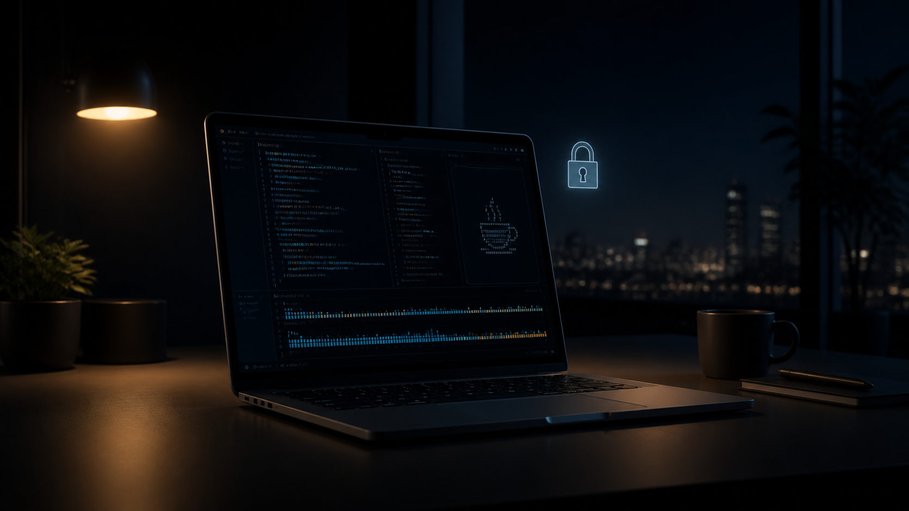

我经常会在 MacBook 的 tmux 会话里运行 Claude Code，让它执行耗时较长的分析、重构或测试任务。任务开始以后，我希望可以锁定屏幕离开一会儿，同时让 Claude Code 和 tmux 继续运行。



这个场景里最容易混淆的是锁屏、显示器熄灭和系统睡眠。锁屏只是不让其他人进入桌面，显示器熄灭也只是关闭画面；只有进入系统睡眠以后，普通进程才会暂停。

因此先记住一句话：

> **锁屏不等于睡眠，tmux 也不能阻止 Mac 睡眠。**

tmux 解决的是终端断开问题，`caffeinate` 和 `pmset` 解决的才是电源管理问题。

## 最适合日常使用的命令

如果 MacBook 保持开盖，只需要锁屏并允许显示器正常熄灭，最实用的命令是：

```bash
caffeinate -i claude
```

它可以理解成：

```text
运行 Claude Code
    ↓
Claude 进程存活期间
    ↓
阻止 idle system sleep
    ↓
Claude 退出
    ↓
caffeinate 自动结束
```

这里的 `-i` 只阻止系统因为长时间无人操作而进入空闲睡眠，不会强行保持屏幕常亮。锁屏后，显示器仍然可以按照系统设置自动熄灭，后台任务则继续运行。

如果 Claude Code 运行在 tmux 中，完整流程就是：

```text
在 tmux 中执行 caffeinate -i claude
    ↓
detach 或保留当前 tmux client
    ↓
短按 Touch ID / 电源键，或按 Control + Command + Q 锁屏
    ↓
显示器随后熄灭
    ↓
Mac 准备因为 idle 自动睡眠
    ↓
caffeinate -i 阻止空闲系统睡眠
    ↓
Claude Code 与 tmux 继续运行
```

之后重新登录，再用 `tmux attach` 回到原来的会话即可。

## caffeinate 是什么

`caffeinate` 来自英文单词 caffeine，也就是咖啡因。这个命令的名字很形象：给 Mac“灌一杯咖啡”，在满足指定条件时让它保持清醒。

`caffeinate` 通过 macOS 的电源断言，也就是 power assertion，临时改变睡眠行为。它不会永久修改系统设置；命令退出，相应的断言也会释放。

不带任何参数运行时：

```bash
caffeinate
```

默认效果就是阻止空闲系统睡眠，与单独运行 `caffeinate -i` 基本相同。按 `Control + C` 结束后，Mac 恢复正常的自动睡眠策略。

## caffeinate 常用参数

| 命令或参数 | 英文来源或助记 | 英文含义 | 实际效果 |
|---|---|---|---|
| `caffeinate` | caffeine | 咖啡因、使保持清醒 | 默认阻止空闲系统睡眠，直到命令退出 |
| `-i` | idle | 空闲、闲置 | 阻止 idle system sleep，最适合后台任务 |
| `-d` | display | 显示器 | 阻止显示器因空闲而熄灭 |
| `-s` | system | 系统 | 阻止系统睡眠，只在接通电源时有效 |
| `-m` | media，可作为助记 | 介质、磁盘 | 阻止磁盘因空闲而睡眠 |
| `-u` | user active | 用户处于活跃状态 | 声明“用户最近有活动”；显示器已关闭时还会将它唤醒 |
| `-t 3600` | timeout | 超时时间 | 断言持续 3600 秒，之后自动释放 |
| `-w PID` | wait | 等待 | 保持断言，直到指定 PID 的进程退出 |

参数可以组合。例如：

```bash
caffeinate -di
```

这会同时阻止显示器熄灭和空闲系统睡眠。不过对于锁屏后长时间运行 Claude Code 的场景，通常只需要 `-i`。加入 `-d` 会让屏幕一直亮着，既耗电，也没有必要。

`-u` 也不适合用来守护长任务。没有配合 `-t` 时，它的默认持续时间只有 5 秒，更像是一次“用户刚刚动过电脑”的活动提示。

## 按时间保持清醒

让 Mac 在接下来一小时内不因为空闲而睡眠：

```bash
caffeinate -i -t 3600
```

让它保持两小时：

```bash
caffeinate -i -t 7200
```

到达指定秒数后，`caffeinate` 会自动退出，不需要回来手动关闭。

需要注意，`-t` 是电源断言的超时时间。如果同一条命令后面直接跟了要运行的程序，macOS 手册规定这个 timeout 不会用于该程序模式。要让断言准确跟随任务生命周期，直接包住命令更清楚：

```bash
caffeinate -i claude
```

## 跟随已经运行的进程

如果 Claude Code 已经启动，可以先找到它的 PID，再让 `caffeinate` 等待这个进程结束。假设 PID 是 `12345`：

```bash
caffeinate -i -w 12345
```

运行关系是：

```text
PID 12345 仍在运行 → 保持防止空闲睡眠的断言
PID 12345 退出     → 释放断言，caffeinate 结束
```

`-w` 适合给已经存在的任务补上防睡眠保护。新任务则优先使用 `caffeinate -i claude`，命令更直接，也不需要先找 PID。

## 如何确认 caffeinate 正在生效

可以查看系统当前的电源断言：

```bash
pmset -g assertions
```

使用 `caffeinate -i` 时，输出中通常可以看到 `PreventUserIdleSystemSleep` 一类的断言，以及持有它的 `caffeinate` 进程。这个命令非常适合排查“明明运行了 caffeinate，Mac 为什么还是睡了”的问题。

## caffeinate 的边界

`caffeinate -i` 防止的是 idle sleep，也就是系统因无人操作而自动睡眠。它不会把所有睡眠入口都封住。

下面这些情况不能只依赖 `caffeinate -i`：

- 主动点击“睡眠”或执行 `pmset sleepnow`。
- MacBook 电量过低、关机或重新启动。
- 系统因为温度、硬件或其他保护机制采取动作。
- 直接合上 MacBook 屏幕。

其中最重要的是最后一点：**`caffeinate` 不能被当成可靠的“合盖不睡”工具。** 合盖属于独立于普通 idle sleep 的睡眠触发条件，tmux 也无法改变它。

如果只是离开工位，推荐保持开盖、锁定屏幕并使用 `caffeinate -i`。这套方式简单、临时、任务结束后会自动恢复，也最不容易忘记清理。

## 更强的 pmset disablesleep

如果确实需要尝试让 MacBook 合盖后仍然运行，可以使用更强的系统级开关：

```bash
sudo pmset -a disablesleep 1
```

这条命令可以拆开理解：

| 部分 | 英文 | 含义 |
|---|---|---|
| `sudo` | superuser do，常用助记 | 以更高权限执行；默认使用 root 身份 |
| `pmset` | power management settings | 修改 macOS 电源管理设置 |
| `-a` | all | 应用于所有电源来源 |
| `disablesleep` | disable sleep | 禁用系统睡眠，是一个完整的设置名 |
| `1` | true / on | 打开“禁止睡眠”开关 |

当系统显示 `SleepDisabled 1` 时，它表达的是：

> **系统睡眠在更高层被禁用。**

这与 `caffeinate -i` 的思路不同。`caffeinate -i` 是某个进程临时声明“不要因为 idle 让我睡”；`disablesleep 1` 则是在系统层关闭睡眠能力，因此更强，也常被用于合盖继续运行的场景。

可以这样检查当前状态：

```bash
pmset -g | grep -i SleepDisabled
```

不过，`disablesleep` 没有出现在 `pmset` 的公开手册中，属于未公开说明的系统设置。它在不同 Mac 型号和 macOS 版本上的行为可能变化，不适合当成跨版本、无条件可靠的正式接口。启用后应先在自己的设备上验证，不要只看命令没有报错就直接离开。

## 用完一定要恢复

与跟随进程退出的 `caffeinate` 不同，`pmset disablesleep` 不会在 Claude Code 结束时自动帮你恢复。任务完成后要主动执行：

```bash
sudo pmset -a disablesleep 0
```

这里的 `0` 表示 false / off，也就是关闭“禁止睡眠”开关，让系统重新允许睡眠。

使用合盖运行时还要注意散热和电量。不要把一台被禁止睡眠、仍在执行高负载任务的 MacBook 放进电脑包，也不要在堵住进出风位置的环境里长时间运行。即使系统层面没有睡眠，过热、低电量和关机仍然会终止任务。

## caffeinate 和 disablesleep 怎么选

| 使用场景 | 推荐方式 | 原因 |
|---|---|---|
| 开盖运行 Claude Code，离开时锁屏 | `caffeinate -i claude` | 只阻止 idle sleep，屏幕仍可熄灭，任务退出后自动恢复 |
| 临时保持一段时间不睡 | `caffeinate -i -t 秒数` | 到时自动结束，不修改长期设置 |
| 跟随已经运行的进程 | `caffeinate -i -w PID` | 进程退出时自动释放断言 |
| 演示或监控时屏幕也要常亮 | `caffeinate -di` | 同时阻止显示器和系统因空闲进入睡眠 |
| 确实需要尝试合盖继续运行 | `sudo pmset -a disablesleep 1` | 系统级禁止睡眠，但风险更高，用完必须恢复 |

对我的 `MacBook + tmux + Claude Code` 工作流来说，默认选择仍然是：

```bash
caffeinate -i claude
```

然后锁屏，让显示器自然熄灭。只有明确需要合盖、设备放在固定且通风的位置，并且记得任务结束后恢复设置时，才使用 `disablesleep 1`。

最后再总结一次三者的分工：

```text
tmux          → 终端断开后，会话和进程仍然存在
caffeinate -i → 阻止 Mac 因空闲自动睡眠
disablesleep  → 在更高层禁用系统睡眠
```

把这三层分清以后，“锁屏后任务为什么还在”和“合盖后任务为什么停了”就不再是同一个问题。
