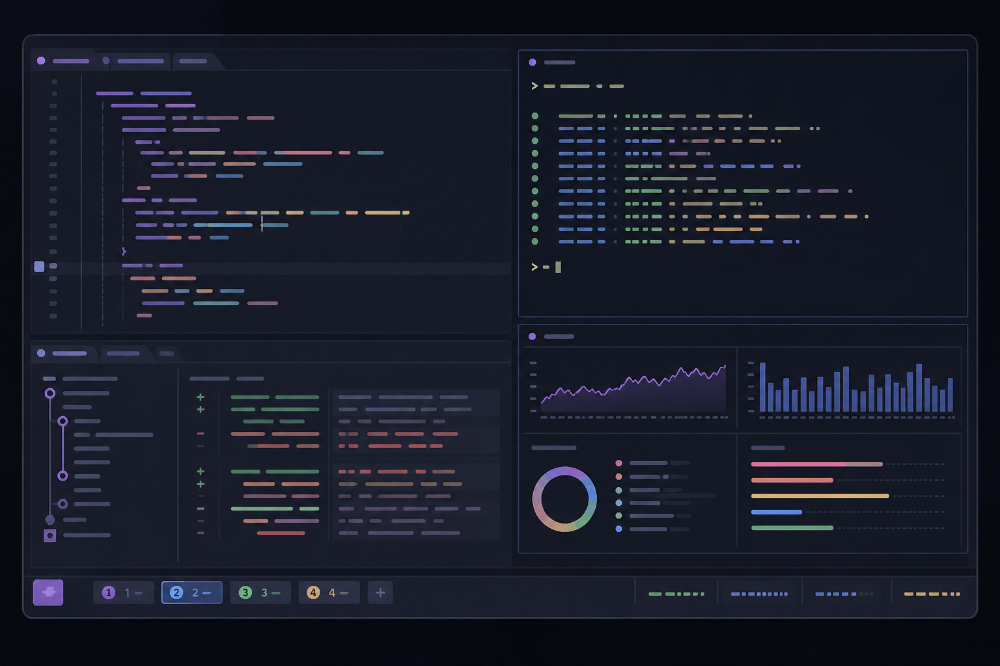

我现在的日常终端工作流是 `Ghostty + zsh + tmux`。Ghostty 负责窗口、字体和渲染，zsh 负责命令环境，tmux 则负责真正的工作区：项目会话、窗口、分屏、后台任务、状态栏和恢复。



tmux 最初吸引我的原因很简单：SSH 断开以后任务还在，关闭终端再回来也能继续。但真正用久以后，它的价值已经不只是“让进程不退出”，而是给命令行建立一层稳定、可编程、能跨终端复用的工作区。

本文先从零介绍 tmux 的概念、命令和配置，再完整拆解我目前位于 `~/.config/tmux` 的实践。本文本地环境为 tmux 3.7c；基础命令同时参考了 tmux 官方 Getting Started 与当前手册。

## tmux 是什么

tmux 是 terminal multiplexer，也就是终端复用器。它在一个终端界面里管理多组 shell 和程序，并把这些状态放在独立的 tmux server 中。

这带来三个直接好处：

- 一个终端里可以创建多个窗口和分屏，不依赖终端模拟器自己的 Tab 或 Split。
- 客户端可以 detach，程序继续在后台运行，之后再 attach 回来。
- 会话、窗口、分屏、按键和状态栏都能用配置与脚本控制。

tmux 的结构可以从外到内理解为：

```text
tmux server
└── session：一个工作区，通常对应一个项目
    ├── window：工作区里的页面，类似终端 Tab
    │   ├── pane：一个伪终端，运行 shell、编辑器或其他程序
    │   └── pane
    └── window
```

除此以外还有 client。Ghostty、iTerm2 或系统终端里显示出来的 tmux 界面，就是一个连接到 session 的 client。关闭 client 不等于删除 session；只要 tmux server 还在，里面的进程就继续运行。

这几个概念最好一开始就分清：

| 概念 | 类比 | 适合承载 |
|---|---|---|
| server | 后台管理进程 | 所有 tmux 状态 |
| session | 项目工作区 | 一个仓库、一个远程环境或一项长期任务 |
| window | Tab / 页面 | 编辑器、Git、日志、数据库 |
| pane | 分屏 | shell、服务、测试、实时日志 |
| client | 正在查看 tmux 的终端 | 本机终端或 SSH 连接 |

## 安装 tmux

macOS 使用 Homebrew：

```bash
brew install tmux
```

Ubuntu 或 Debian：

```bash
sudo apt update
sudo apt install tmux
```

Fedora：

```bash
sudo dnf install tmux
```

Arch Linux：

```bash
sudo pacman -S tmux
```

安装后先确认版本：

```bash
tmux -V
```

不同系统软件源中的 tmux 版本可能有差异。如果某个配置项无法识别，先看 `tmux -V` 和 `man tmux`，不要直接判断成终端或按键坏了。

## 第一次启动

直接运行：

```bash
tmux
```

tmux 会启动 server，创建一个 session，并让当前终端连接进去。更推荐从一开始就给 session 起名字：

```bash
tmux new-session -s blog
```

`new-session` 可以简写成 `new`：

```bash
tmux new -s blog
```

界面底部会出现一条状态栏，通常能看到 session 名、window 序号、window 名和时间。

### Prefix 是什么

tmux 默认前缀键是 `Ctrl-b`。大多数快捷键不是同时按下，而是：

1. 按一次 `Ctrl-b`，然后松开。
2. 再按具体命令键。

后文用 `prefix c` 表示“先按前缀键，再按 `c`”。它和 `Ctrl-b + c` 同时按不是一回事。

第一次使用时，先记住下面几个默认键就够了：

| 快捷键 | 作用 |
|---|---|
| `prefix c` | 新建 window |
| `prefix n` / `p` | 下一个 / 上一个 window |
| `prefix 0`…`9` | 按序号切换 window |
| `prefix %` | 左右分屏 |
| `prefix "` | 上下分屏 |
| `prefix` + 方向键 | 切换 pane |
| `prefix z` | 当前 pane 全屏，再按一次恢复 |
| `prefix x` | 关闭当前 pane |
| `prefix d` | detach，退出界面但保留 session |
| `prefix ?` | 查看所有按键 |

## Session 的常用命令

### 查看、连接和退出

列出所有 session：

```bash
tmux list-sessions
tmux ls
```

连接到指定 session：

```bash
tmux attach-session -t blog
tmux attach -t blog
```

如果这个 session 已被另一台终端连接，希望先断开旧 client 再连接：

```bash
tmux attach -d -t blog
```

创建或连接同名 session 可以合成一条命令：

```bash
tmux new-session -A -s blog
```

这很适合放进终端启动脚本：存在就 attach，不存在就创建。

在 tmux 里面按 `prefix d` 只会 detach，不会结束 session。真正删除指定 session：

```bash
tmux kill-session -t blog
```

删除全部 session 和 server：

```bash
tmux kill-server
```

最后一条会结束所有 tmux 工作区，运行前要确认没有未保存的任务。

### 从 tmux 内切换 session

默认快捷键中：

| 快捷键 | 作用 |
|---|---|
| `prefix s` | 列出并选择 session |
| `prefix w` | 以树形列表选择 session 和 window |
| `prefix (` / `)` | 上一个 / 下一个 session |
| `prefix $` | 重命名当前 session |

当 session 数量变多以后，`prefix w` 往往比记名字更方便。

## Window 和 Pane 的使用

Window 适合分离不同类型的工作，pane 适合同时观察或操作相关任务。例如一个项目可以这样组织：

```text
session: blog
├── window 1: editor
│   ├── pane 1: nvim
│   └── pane 2: npm run dev
├── window 2: git
│   └── pane 1: lazygit
└── window 3: logs
    ├── pane 1: application log
    └── pane 2: database log
```

除了快捷键，也可以从 shell 或 tmux 的命令提示符执行命令：

```bash
tmux new-window -n logs
tmux split-window -h
tmux split-window -v
tmux select-pane -L
tmux select-pane -R
tmux resize-pane -Z
```

`-h` 表示左右分割，`-v` 表示上下分割。`resize-pane -Z` 用来切换当前 pane 的缩放状态。

按 `prefix :` 会打开 tmux 命令提示符。此时输入的是 tmux 命令，不需要再写开头的 `tmux`：

```text
new-window -n logs
split-window -h
rename-window server
```

## 复制模式与滚动历史

tmux 接管终端以后，历史输出也由 tmux 管理。默认按 `prefix [` 进入 copy mode，按 `q` 退出，按 `prefix ]` 粘贴 tmux buffer。

我更习惯 vi 键位：

```tmux
set -g mode-keys vi

bind -T copy-mode-vi v   send-keys -X begin-selection
bind -T copy-mode-vi C-v send-keys -X rectangle-toggle
bind -T copy-mode-vi y   send-keys -X copy-pipe-and-cancel "~/.config/tmux/scripts/copy_to_clipboard.sh"
```

这样在 copy mode 中可以用 `hjkl` 移动，`v` 开始选择，`Ctrl-v` 切换块选择，`y` 复制并退出。脚本再把内容同时写入 tmux buffer 和系统剪贴板。

鼠标模式下还可以滚轮查看历史：

```tmux
set -g mouse on
set -g history-limit 50000
```

如果正在运行 vim、Claude Code 等开启鼠标上报的程序，普通拖动可能由前台程序接管。在 Ghostty 中按住 `Shift` 再拖动，可以强制使用终端自身的文本选择；如果要严格按 pane 边界复制，则使用 tmux copy mode。

## tmux 配置文件

tmux 默认先读取系统配置，再查找用户配置：

```text
~/.tmux.conf
$XDG_CONFIG_HOME/tmux/tmux.conf
```

我的配置位于：

```text
~/.config/tmux/tmux.conf
```

配置文件本质上就是一组 tmux 命令。tmux server 启动时只自动读取一次；修改以后，可以手动执行：

```bash
tmux source-file ~/.config/tmux/tmux.conf
```

也可以绑定重载快捷键：

```tmux
bind r source-file ~/.config/tmux/tmux.conf \; display-message "已重载 tmux.conf"
```

### 一份适合起步的配置

下面这份配置不依赖插件，适合先建立自己的按键习惯：

```tmux
# 响应与终端能力
set -s escape-time 0
set -s focus-events on
set -g mouse on
set -g history-limit 50000

# window / pane 从 1 开始编号
set -g base-index 1
setw -g pane-base-index 1
set -g renumber-windows on

# vi 复制模式
set -g mode-keys vi

# 真彩色
set -g default-terminal "tmux-256color"
set -as terminal-features ",xterm-256color:RGB"

# 重载配置
bind r source-file ~/.config/tmux/tmux.conf \; display-message "tmux.conf reloaded"

# 新 window 和 pane 继承当前 pane 的目录
bind c new-window -c "#{pane_current_path}"
bind | split-window -h -c "#{pane_current_path}"
bind - split-window -v -c "#{pane_current_path}"

# Vim 风格切换 pane
bind h select-pane -L
bind j select-pane -D
bind k select-pane -U
bind l select-pane -R
```

这里最值得保留的是 `-c "#{pane_current_path}"`。它让新 window 或 pane 从当前目录启动。老配置中常见的 `default-path` 已经被移除，不应该再照抄。

### `set`、`setw`、`bind` 和 `bind -n`

配置中最常见的命令可以这样理解：

| 写法 | 作用 |
|---|---|
| `set -g` | 设置全局 session 选项 |
| `setw -g` | 设置全局 window 选项 |
| `bind x ...` | 把 `prefix x` 绑定到命令 |
| `bind -n x ...` | 不需要 prefix，直接监听按键 |
| `unbind x` | 删除已有绑定 |
| `run-shell ...` | 执行外部脚本 |
| `set-hook ...` | 在 tmux 事件发生时执行命令 |

`bind -n` 很方便，但也更容易和 shell、编辑器或系统快捷键冲突。直接绑定前，最好先确认这个组合键真的能够从操作系统传到终端。

## 插件管理：TPM、Resurrect 与 Continuum

tmux 本身已经能完成绝大多数窗口管理。需要插件时，我使用 [TPM](https://github.com/tmux-plugins/tpm) 管理：

```tmux
set -g @plugin 'tmux-plugins/tpm'
set -g @plugin 'tmux-plugins/tmux-resurrect'
set -g @plugin 'tmux-plugins/tmux-continuum'

run '~/.config/tmux/plugins/tpm/tpm'
```

[tmux-resurrect](https://github.com/tmux-plugins/tmux-resurrect) 用来保存和恢复 session、window、pane、布局与工作目录，[tmux-continuum](https://github.com/tmux-plugins/tmux-continuum) 负责定期触发保存。

我的实际配置是：

```tmux
set -g @resurrect-save 'S'
set -g @resurrect-restore 'R'
set -g @resurrect-capture-pane-contents 'on'
set -g @resurrect-processes 'lazygit yazi'
set -g @continuum-save-interval '15'
set -g @continuum-restore 'off'
```

也就是每 15 分钟保存一次，`prefix S` 手动保存，`prefix R` 手动恢复，但开机后不自动恢复。我希望工作区结构可以找回来，同时保留一次人工确认，而不是启动终端就把所有旧任务全部拉起。

需要注意，Resurrect 恢复的是终端工作区，不是虚拟机快照。session、布局、目录和配置过的程序可以恢复，但任意程序运行到一半的内存状态不会被原样冻结。

## 我的实践：把 tmux 变成项目工作台

我的 `~/.config/tmux` 不是一个孤立的 `tmux.conf`，而是一个自包含目录：

```text
~/.config/tmux/
├── tmux.conf                  # 主配置
├── bin/
│   ├── ghostty-boot           # Ghostty 首次启动时进入 tmux
│   └── start-agent            # 创建项目 / Agent 工作区
├── scripts/                   # 快捷键、通知、会话和配色脚本
├── tmux-status/               # 左右状态栏入口
├── agent-tracker/             # Go 编写的状态栏与 Agent 工具
├── plugins/                   # TPM 插件
├── docs/                      # 使用与维护文档
└── bak/                       # 未启用功能和上游配置快照
```

这套实践的核心原则是：

> 一个项目对应一个 tmux session；一个并行分支对应一个 Git worktree 和独立 session。

### Ghostty 启动时自动进入 main

Ghostty 的第一个 surface 会运行 `ghostty-boot`。脚本的核心只有一条：

```bash
tmux new-session -A -s main
```

`main` 已存在就连接，不存在就创建。detach 或 tmux 启动失败以后，脚本会回到登录 shell：

```bash
exec "${SHELL:-/bin/zsh}" -l
```

我只让 Ghostty 冷启动时的第一个终端走这条路径。新窗口、新 Tab 和 Quick Terminal 仍然是干净的 zsh，给自己保留一个不经过 tmux 的排障入口。

### 我把 prefix 从 `Ctrl-b` 改成了 `Ctrl-s`

```tmux
unbind C-b
set -g prefix C-s
bind C-s send-prefix
```

`Ctrl-s` 对我的手位更自然。第三行也不能省：当终端程序真的需要接收字面量 `Ctrl-s` 时，按两次 `Ctrl-s` 可以通过 `send-prefix` 把它送进去。

这也产生了一个插件冲突：Resurrect 默认保存键会占用 `prefix + C-s`，所以我把保存和恢复改到了大写 `S`、`R`。

### 高频动作不经过 prefix

对于一天会使用几十次的动作，我直接绑定到右 Option，也就是 tmux 中的 `Alt` / `M-`：

| 我的快捷键 | 作用 |
|---|---|
| `Alt-h/j/k/l` | 向左 / 下 / 上 / 右创建 pane |
| `Alt-Shift-H/J/K/L` | 向对应方向调整 pane 大小 |
| `Alt-f` | 当前 pane 全屏 / 恢复 |
| `Alt-Space` | 切换下一种布局 |
| `Alt-q` | 关闭 pane |
| `Alt-t` | 在当前目录新建 window |
| `Alt-1`…`9` | 切换到对应 window |
| `Alt-u/o` | 向左 / 右调整 window 顺序 |
| `Alt-n` | 新建 session |
| `Alt-a` | 跳到下一个等待处理的 Claude window |

分屏绑定直接表达新 pane 出现的方向，并继承当前目录：

```tmux
bind -n M-h split-window -hb -c "#{pane_current_path}"
bind -n M-j split-window -v  -c "#{pane_current_path}"
bind -n M-k split-window -vb -c "#{pane_current_path}"
bind -n M-l split-window -h  -c "#{pane_current_path}"
```

window 则用 `Alt-1` 到 `Alt-9` 直接选择：

```tmux
bind -n M-1 select-window -t 1
bind -n M-2 select-window -t 2
bind -n M-3 select-window -t 3
```

macOS 上的 Option 默认用于输入特殊字符。我的 Ghostty 配置使用：

```text
macos-option-as-alt = right
```

这样只有右 Option 会发送 Alt，左 Option 仍保留 macOS 原来的字符输入功能。tmux 自己无法分辨左右 Option，因为它最终收到的只是终端编码后的字节；左右键的分流必须在 Ghostty 这一层完成。

### 被系统快捷键抢走的按键如何处理

Bob、Raycast 和 macOS 全键盘访问会抢占部分 `Option + 数字`、`Option + Space` 和功能键。发生在操作系统层的拦截，靠改 tmux 配置解决不了，因为按键根本没有到达终端。

我的处理方式是在 Karabiner 中先把物理按键改写成空闲的功能键组合，再由 tmux 绑定。例如：

```text
右 Option + 1  → Shift + F1       → tmux 切到 window 1
右 Cmd + 1     → Option+Shift+F1  → tmux 切到 session 1
```

F2 和 F3 在这套环境里会与 macOS 焦点导航或终端响应序列冲突，因此数字映射实际使用 F1、F4 到 F11。

排查这类问题时，我按三层定位：

1. 先在 Karabiner-EventViewer 看改写规则是否命中。
2. 再在 tmux 外运行 `cat -v`，确认终端是否收到转义序列。
3. 最后用 `tmux list-keys` 检查绑定是否存在。

EventViewer 正常但 `cat -v` 没输出，通常说明按键被 macOS 或其他应用截走；`cat -v` 有输出而 tmux 没反应，才应该继续检查 tmux 键名、key table 或 server 状态。

### 一个项目就是一个 session

我写了 `start-agent`，并在 zsh 中包装成三个命令：

| 命令 | 第一个 window | 第二个 window |
|---|---|---|
| `sa` | `claude` | `lazygit` |
| `sac` | `claude --continue` | `lazygit` |
| `sar` | `claude --resume` | `lazygit` |

常用方式：

```bash
sa                    # 当前项目、当前分支
sa feat/search        # 切到或创建分支，再打开工作区
sa -w feat/search     # 创建独立 worktree 和 session
sar -w feat/search    # 在独立 worktree 中恢复 Claude 会话
```

默认 session 使用项目目录名；`-w` 模式使用“项目名/分支名”。如果 session 已存在，脚本只切换过去，不会重复创建 window 或再次启动 Agent。

创建新工作区时，脚本会建立两个 window：

```bash
tmux new-session -d -s "$session" -n "$claude_alias" -c "$workdir"
tmux new-window -t "$session:" -n lg -c "$workdir"
```

随后通过 `send-keys` 把 zsh alias 输入交互式 shell。这样做是因为 `cc`、`ccc`、`ccr` 和 `lg` 是 `.zshrc` 中的 alias，非交互 shell 不会加载它们。

### 用 Git worktree 隔离并行 Agent

在同一个工作目录里切分支，前一个 Agent 正在编辑的文件会被后一次切换影响。`sa -w` 会把分支放到：

```text
<仓库>/.worktrees/<分支>/
```

并为它建立独立 session。每个 Agent 因此拥有自己的目录、分支、窗口和进程，不会互相踩文件。

脚本把 `/.worktrees/` 写入仓库本地的 `.git/info/exclude`，而不是修改项目共享的 `.gitignore`。这类机器相关的工作区目录不应该强制影响团队仓库。

我的典型并行结构是：

```text
1-project/main
├── claude
└── lazygit

2-project/feat-search
├── claude --resume
└── lazygit

3-project/fix-login
├── claude
└── lazygit
```

### tmux 没有我要的 session 顺序，就用命名约定补上

我希望可以用右 `Cmd + 1…9` 在项目之间直接切换，但 tmux session 没有像 window index 那样的固定人工顺序。

我的做法是给真实 session 名加数字前缀：

```text
1-blog
2-api
3-feat-search
```

`session_manager.py` 负责新建、重命名和左右移动时维护前缀；状态栏渲染时再把前缀去掉，所以视觉上仍然只显示 `blog`、`api`、`feat-search`。

这是一种很实用的 tmux 扩展方式：不要强迫 tmux 拥有它没有的数据结构，而是利用稳定命名、格式变量和外部脚本补出所需行为。

### 状态栏不只是装饰

我的状态栏分成四段：

```text
session 列表 | window 列表 | CPU / 网速 / 内存 / 主机名 | 日期时间
```

- 左侧由 `tmux-status/left.sh` 读取所有 session 并渲染。
- 中间 window 列表由 tmux 原生格式完成。
- 右侧系统指标由 `agent-tracker/bin/agent tmux right-status` 渲染。
- 日期时间直接使用 tmux 格式，不启动额外进程。

左侧 session 使用 `#[range=session|<id>]` 标出可点击区域，因此沿用 tmux 内建的 `MouseDown1Status → switch-client -t =` 就能点击切换，不需要另写鼠标绑定。

右侧状态栏每秒刷新一次。我给它做了独立开关：

```tmux
bind t run-shell "~/.config/tmux/scripts/status_right.sh toggle"
bind T set -g status
```

`prefix t` 会把 `status-right` 真正置空，负责资源统计的一次性子进程也不再执行；`prefix T` 则关闭整条状态栏。这比只隐藏输出更节省资源。

配色由脚本读取 Starship 当前 palette，生成一个很小的 `palette.conf`，再同步给 tmux 和 Go 状态栏程序。这样切换 Catppuccin 主题时，shell prompt、pane 边框、复制选区和状态栏会一起变化。

### 用 tmux 标记 Claude 的等待与完成状态

同时运行多个 Agent 时，最难的不是启动，而是知道谁在等授权、谁已经结束。

Claude Code 的 Notification 和 Stop hooks 会调用 `claude_notify.sh`。脚本通过 `$TMUX_PANE` 找到所在 window，并写入用户选项：

```bash
tmux set -w -t "$win_id" @claude_state input
tmux set -w -t "$win_id" @claude_state done
```

window 状态格式再根据这个值显示图标：

```text
❓ 等待输入或授权
🔔 本轮已经完成
```

切到对应 window 后，`after-select-window` 和 `pane-focus-in` hook 会清掉标记。`Alt-a` 则跨 session 查找下一个带标记的 window，并优先跳到真正阻塞工作的 `input` 状态。

系统通知也会附带 session 与 window 名。安装 `terminal-notifier` 时，点击通知可以直接切换 tmux 目标并把 Ghostty 拉到前台；没有安装时退回 `osascript`，仍然可以显示通知和声音。

一个重要细节是：只有“当前 window 已连接，并且 Ghostty 确实在前台”时才抑制通知。仅检查 tmux 的 `window_active` 不够，因为用户可能早已切到浏览器，而 tmux 仍认为那个 window 是 active。

## 这套配置里我刻意没有做的事

配置越复杂，越需要明确哪些功能不启用。

- 不开启 tmux `extended-keys`。在我的 Ghostty 与快捷键组合下，它会改变 `Alt+Shift+字母` 的编码，使现有 `M-W` 等绑定失效。
- 不让 Continuum 开机自动恢复。工作区可以手动恢复，但我不希望旧任务未经确认全部启动。
- 不把 Agent tracker server 装成常驻服务。CPU、网速、系统内存和主机名由状态栏刷新时的一次性进程提供。
- 不把所有实验功能继续堆在主配置中。未启用脚本放进 `bak/unused`，上游原版配置放进 `bak/upstream`。
- 不用 tmux 管终端渲染，也不用 Ghostty 管项目状态。每一层只承担自己擅长的职责。

## 常见问题

### 改了配置为什么没生效

先执行：

```bash
tmux source-file ~/.config/tmux/tmux.conf
```

或使用自己绑定的重载键。少数 server 级行为在已有 server 中切换后仍可能受到旧客户端或终端协商影响，排查时可以在保存工作后新开一个独立 tmux server 验证。

### 颜色不正确或只有 256 色

先检查终端外的 `$TERM`、tmux 内的 `$TERM`，以及系统是否安装 `tmux-256color`：

```bash
echo "$TERM"
infocmp tmux-256color
tmux display-message -p '#{client_termname}'
```

终端能力应该通过 `default-terminal` 和 `terminal-features` 正确声明，不要只靠到处写 `TERM=xterm-256color` 强行覆盖。

### Alt 快捷键完全没反应

先在 tmux 外运行：

```bash
cat -v
```

按下快捷键。如果什么都没有，问题发生在 macOS、Karabiner、全局快捷键或终端设置层；如果能看到转义序列，再检查 `tmux list-keys`。

### 新 pane 总是回到错误目录

在 `split-window` 和 `new-window` 上显式增加：

```tmux
-c "#{pane_current_path}"
```

不要使用已经移除的 `default-path`，也不要用 tmux server 启动时的 `$PWD` 猜测当前 pane 所在目录。

### SSH 断开后 session 为什么也没了

正常 detach 或网络断开不会删除 session。但机器重启、tmux server 被结束、最后一个 session 被删除，都会让内存中的 tmux 状态消失。需要跨重启恢复时，使用 Resurrect / Continuum，并清楚它们恢复的是布局、目录和配置过的程序，而不是所有进程的完整运行状态。

## 从基础配置逐步长成自己的工作流

刚开始使用 tmux 时，没有必要复制一份几百行的配置。更稳妥的顺序是：

1. 先熟悉 session、window、pane 和 detach / attach。
2. 只修改 prefix、鼠标、历史行数和 pane 导航。
3. 把高频动作改成符合自己手位的快捷键。
4. 再加入目录继承、复制到系统剪贴板和真彩色。
5. 工作区确实需要跨重启时，再安装 TPM、Resurrect 和 Continuum。
6. 最后才考虑状态栏脚本、通知、worktree 和 Agent 编排。

我的配置最终有主配置、Shell、Python 和 Go，不是因为 tmux 必须复杂，而是它逐渐接住了真实工作中反复出现的问题：快速进入项目、同时跑多个分支、观察 Agent 状态、恢复窗口结构、从通知回到准确的任务位置。

tmux 最有价值的地方，也正是这种可生长性。先把它当作可靠的会话与分屏工具，再让每一条配置回答一个具体问题。等使用习惯稳定以后，它自然会从“终端里的工具”变成整个命令行工作的骨架。

## 参考资料

- [tmux 官方 Getting Started](https://github.com/tmux/tmux/wiki/Getting-Started)
- [tmux 官方 Wiki](https://github.com/tmux/tmux/wiki)
- [tmux 源码仓库](https://github.com/tmux/tmux)
- [Tmux Plugin Manager](https://github.com/tmux-plugins/tpm)
- [tmux-resurrect](https://github.com/tmux-plugins/tmux-resurrect)
- [tmux-continuum](https://github.com/tmux-plugins/tmux-continuum)
