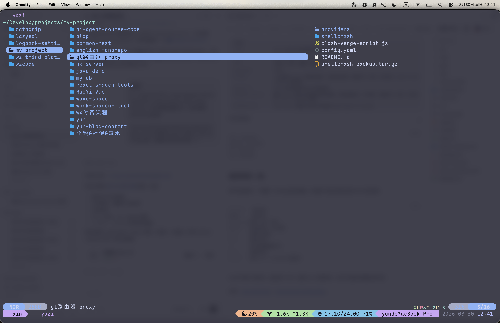

Yazi 是一个用 Rust 编写的终端文件管理器。它启动快、支持异步 I/O，既能用方向键操作，也提供了接近 Vim 的键位。日常在终端里浏览目录、复制路径或整理文件时，可以少打很多命令。



启动 Yazi：

```bash
yazi
```

按 `q` 退出；按 `F1` 或 `~` 可以随时查看完整帮助。

> 本文记录的是 Yazi 26.8.15 文档中的默认键位。如果你修改过 `~/.config/yazi/keymap.toml`，实际行为可能不同。

## 先理解组合键的写法

本文中的 `c` → `c` 不是同时按下两个键，而是先按一次 `c`，再按一次 `c`。同理，`g` → `g`、`,` → `m` 和 `t` → `t` 都是连续按键。

## 复制路径和文件名

| 快捷键 | 作用 |
|---|---|
| `c` → `c` | 复制文件路径 |
| `c` → `d` | 复制文件所在目录的路径 |
| `c` → `f` | 复制完整文件名 |
| `c` → `n` | 复制不带扩展名的文件名 |

例如当前文件是 `/Users/yun/blog/hello.md`：

| 快捷键 | 复制结果 |
|---|---|
| `c` → `c` | `/Users/yun/blog/hello.md` |
| `c` → `d` | `/Users/yun/blog` |
| `c` → `f` | `hello.md` |
| `c` → `n` | `hello` |

这里复制的是路径文本，不是把文件本身复制到另一个目录，也不是带 `file://` 前缀的浏览器 URL。要复制文件本身，使用 `y` 暂存，再进入目标目录按 `p` 粘贴。

## 浏览目录

| 快捷键 | 作用 |
|---|---|
| `j` / `↓` | 向下移动 |
| `k` / `↑` | 向上移动 |
| `l` / `→` | 进入目录或打开文件 |
| `h` / `←` | 返回上一级目录 |
| `g` → `g` | 跳到列表顶部 |
| `G` | 跳到列表底部 |
| `.` | 显示或隐藏隐藏文件 |

如果希望隐藏文件始终可见，可以在 `~/.config/yazi/yazi.toml` 中设置：

```toml
[mgr]
show_hidden = true
```

## 文件操作

| 快捷键 | 作用 |
|---|---|
| `Space` | 选中或取消选中当前文件 |
| `v` | 进入连续选择模式 |
| `y` | 复制选中的文件 |
| `x` | 剪切选中的文件 |
| `p` | 粘贴 |
| `P` | 覆盖目标位置的同名文件并粘贴 |
| `a` | 新建文件；名称以 `/` 结尾时新建目录 |
| `r` | 重命名 |
| `d` | 移到回收站 |
| `D` | 永久删除 |

`d` 和 `D` 的差别值得特别注意：`d` 通常还有恢复机会，`D` 是永久删除，使用前一定要确认选中的文件。

## 排序

排序快捷键都以逗号 `,` 开头：

| 快捷键 | 排序方式 |
|---|---|
| `,` → `m` / `M` | 按修改时间正序 / 倒序 |
| `,` → `b` / `B` | 按创建时间正序 / 倒序 |
| `,` → `e` / `E` | 按扩展名正序 / 倒序 |
| `,` → `a` / `A` | 按字母正序 / 倒序 |
| `,` → `n` / `N` | 自然排序正序 / 倒序 |
| `,` → `s` / `S` | 按文件大小正序 / 倒序 |
| `,` → `r` | 随机排序 |

文件名中带数字时，自然排序通常更符合直觉。例如它会把 `file2` 放在 `file10` 前面。

## 多标签页

| 快捷键 | 作用 |
|---|---|
| `t` → `t` | 在当前目录新建标签页 |
| `1` ～ `9` | 切换到对应序号的标签页 |
| `[` / `]` | 切换到上一个 / 下一个标签页 |
| `{` / `}` | 将当前标签页向前 / 向后移动 |
| `Ctrl` + `c` | 关闭当前标签页 |

需要在两个相距很远的目录之间搬运文件时，可以分别打开两个标签页，再用 `y`、`x` 和 `p` 操作。

## fzf、zoxide 与搜索

`z` 和 `Z` 大小写不同，调用的工具也不同：

| 快捷键 | 作用 | 依赖 |
|---|---|---|
| `z` | 通过 fzf 选择目录，或定位并显示文件 | `fzf` |
| `Z` | 根据使用频率快速跳转到目录 | `zoxide` |
| `f` | 实时过滤当前目录中的文件 | 无需 fzf |
| `s` | 使用 fd 按文件名搜索 | `fd` |
| `S` | 使用 ripgrep 按文件内容搜索 | `rg` |
| `Ctrl` + `s` | 取消正在进行的搜索 | — |

可以这样记：小写 `z` 是“现在让我选”，大写 `Z` 是“根据历史直接跳”。如果按键没有反应，先确认对应依赖是否已经安装：

```bash
fzf --version
zoxide --version
fd --version
rg --version
```

## 最常用的一组

刚开始使用时，不需要一次记住全部快捷键。先掌握下面这些就足够应付大多数场景：

```text
h j k l    浏览目录
Space      选择文件
y / x / p 复制、剪切、粘贴
d / D     移到回收站、永久删除
c c       复制文件路径
c f       复制文件名
.         显示或隐藏隐藏文件
t t       新建标签页
z / Z     使用 fzf / zoxide 快速跳转
```

当记不清某个键位时，直接按 `F1` 或 `~` 查看 Yazi 内置帮助，比死记完整快捷键表更实用。

参考：[Yazi Quick Start](https://yazi-rs.github.io/docs/quick-start/)、[Yazi Keymap Configuration](https://yazi-rs.github.io/docs/configuration/keymap/)。
